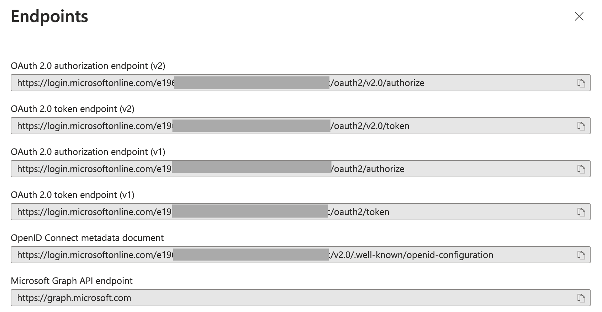

# System Configuration

NeuronEX supports customization of relevant functions on the Dashboard.

## Data Processing Engine Configuration
After logging into NeuronEX, click on **Administration** -> **System Configuration** on the left side to enter the system configuration page. You can manually enable or disable the data processing engine.

:::tip 

Closing the data processing engine will render the data processing function unavailable, so please operation with caution!

:::

## Agent Configuration

When there is an IP change or network address translation after NeuronEX is deployed, and the ECP cannot directly access the NeuronEX service through the IP address, by configuring the agent function, the NeuronEX side configures the connection information on the ECP side, actively initiates the connection, and the ECP realizes Subsequent remote management function.

### Enable Agent Function

In the above situation in order to be managed by ECP, the agent function needs to be enabled on NeuronEX. Click `Administration` -> `System Configuration` -> `Agent Configuration`, click the `Enable Agent` and edit the MQTT information connected to ECP, as shown in the figure below.

* **ECP Service Address**: NeuronEX communicates with ECP through the MQTT protocol. Fill in the MQTT Broker connection address deployed by ECP here.
* **Username**: Authentication information filled in through username and password authentication when connecting to MQTT Broker.
* **Password**: Same as above.
* **Description**: The registration description information of the NeuronEX to facilitate the ECP side to identify the NeuronEX.

In addition, if MQTT Broker requires mutual certificate authentication, the SSL/TLS function needs to be enabled. As shown below.

When the above information is confirmed to be correct, click `Save Agent Configuration` and NeuronEX will register with ECP. Users can manage this NeuronEX after activating it on the ECP side.

### Disable Agent Function

Users can disable agent function by turning off the `Enable Agent` button and clicking `Save Agent Configuration`.

## SSO Configuration

NeuronEX utilizes the OAuth 2.0 protocol to implement single sign-on functionality.

### AIoT

Configure the Single Sign-On (SSO) URL address for NeuronEX on the AIoT platform in the format: [NeuronEX Access Address]/web/common. e.g, http://127.0.0.1:8085/web/common.

The AIoT platform provides the client identifier (App Key) and client secret (App Secret) for the NeuronEX configuration page.

On the NeuronEX page, you need to configure the access address of the SSO service and the related parameters.

:::tip

The fields for Scope, Grant Type, Request Method, and Content Type need to be filled out according to the platform requirements.

:::

### Azure

On the Azure platform, navigate to Microsoft Entra ID -> App registrations page, find the corresponding App, and fill in the Single Sign-On (SSO) URL address for NeuronEX in the same format as before.

On the Overview page, obtain the client identifier (client id) and provide it to the NeuronEX configuration page.

On the Certificates & secrets page, obtain the client secret and provide it to the NeuronEX configuration page.

On the Overview -> Endpoints page, obtain the authorization endpoint URL and token endpoint URL.

On the NeuronEX page, you need to configure the SSO service access address and the related parameters.

:::tip

The fields for Scope, Grant Type, Request Method, and Content Type need to be filled out according to the platform requirements.

:::

## Network Connection Test

Enter the device IP to confirm whether NeuronEX can access the device IP address:

