# AI-generated Python Plugin Guide

## Document Purpose

This guide aims to help NeuronEX users, especially operations personnel or automation engineers, effectively utilize NeuronEX's integrated AI capabilities (combined with LLM models) to generate Python function plugins for complex edge data processing that is difficult to handle with NeuronEX SQL. 

Following these best practices ensures that generated code is functionally correct, performs well, is easy to maintain, and fully leverages NeuronEX's potential in industrial edge computing scenarios.

## Background

NeuronEX provides powerful streaming SQL processing capabilities that can meet most industrial data cleaning, transformation, aggregation, and alerting requirements at the edge. 

However, when facing scenarios such as state maintenance judgments (such as continuous increment detection), complex format conversions, or specific business logic calculations, SQL's expressive capabilities are limited.

NeuronEX supports writing extension functions in languages like Python to address this limitation, but traditionally this requires users to have programming skills and handle development, debugging, and deployment processes. By integrating LLM, NeuronEX has implemented a simplified workflow of "**natural language description** -> **AI-generated Python code** -> **automatic deployment** -> **SQL calling**", greatly reducing the development barrier and improving response time.

## Feature Introduction

Using AI-generated Python plugin functionality in NeuronEX mainly involves the following steps: installation, configuring AI models, using the AI function generation feature, and testing and using generated plugins in rules.

### Installation

Starting from version 3.5.1, NeuronEX provides Docker image packages supporting AI functionality: neuronex:3.5.1-ai and neuronex:3.5.1-ai-amd64. The image packages have pre-installed the Python dependencies required for interacting with LLM models.

Use the following commands to download and run NeuronEX:

```shell
# Download x86 image and run container
docker pull emqx/neuronex:3.5.1-ai
docker run -d --name neuronex -p 8085:8085 --log-opt max-size=100m --privileged=true emqx/neuronex:3.5.1-ai

# Download arm64 image and run container
docker pull emqx/neuronex:3.5.1-ai-amd64
docker run -d --name neuronex -p 8085:8085 --log-opt max-size=100m --privileged=true emqx/neuronex:3.5.1-ai-amd64
```

### AI Model Configuration

Before using the AI-generated Python plugin feature, you need to add LLM model configuration information on the NeuronEX **System Configuration** -> **AI Model Configuration** page, including the LLM model type, API Key, Endpoint address, and model name. Currently, NeuronEX supports models from the following vendors:

| <div style="width:100pt">Model Vendor</div> | <div style="width:120pt">Endpoint Address</div> | <div style="width:120pt">Model Name</div> |
| ------------------------------------------- | --------------------------------------------- | ---------------------------------------- |
| DeepSeek | `https://api.deepseek.com` | `deepseek-chat` <br> `deepseek-reasoner` |
| SiliconFlow | - | `Pro/deepseek-ai/DeepSeek-V3` <br> `deepseek-ai/DeepSeek-V3` |
| OpenAI | `https://api.openai.com/v1` |  `gpt-4o` <br> `gpt-4.1` <br> `o1` <br> `o3-mini` <br> `gpt-4.5-preview` <br> `gpt-4.1-mini` <br> `o4-mini` |
| Azure OpenAI | Obtain from Azure official website | `gpt-4o` <br> `o1-mini` <br>  `o3-mini` |

You can obtain API Keys from the official websites of these model vendors, add model configurations on the NeuronEX page, and enable them. Multiple large models can be configured on the page simultaneously, but only one model can be enabled for use.


::: tip
1. Please ensure that NeuronEX can connect to the internet normally and access the model's API.
2. Small models or excessively outdated models will affect the quality of generated Python plugins. The models in the above table are recommended, and new models released by various vendors can also be used in the future.
:::

### AI-Generated Python Plugins

After configuring the LLM model, go to the NeuronEX **Data Processing** -> **Extensions** page, click **AI Generate Function** to enter the AI function generation page:


On the AI function generation page, you can enter a natural language description of the Python function you want to generate. For example, for a simple mathematical operation, you can enter:

```shell
Please generate a Python function that calculates the result of subtracting two numbers a and b
```

To improve the accuracy of code generated by the large model, you can click the **Add Input Parameter** button to describe the input types, as shown below:

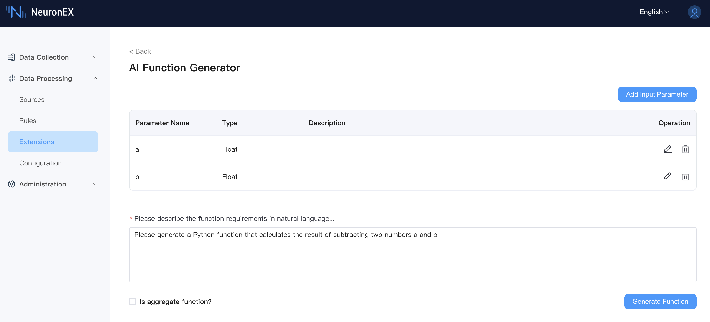

Click the **Generate Function** button, and the large model will generate Python code based on your description and display it in the AI dialog box. This process takes a few seconds, please be patient and refer to the progress bar.


Click the **Deploy Function** button in the above image, and the generated Python code will be automatically deployed to NeuronEX, with a popup indicating successful deployment. If you have questions about the generated code, you can ask in the AI dialog box.

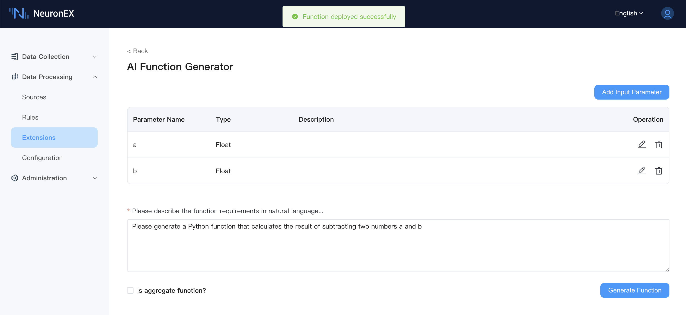

On the algorithm integration list page, you can see the currently deployed function `subtract`:


::: tip
1. Talking to AI cannot adjust the generated function code. If you are not satisfied with the generated function code, you can input and adjust the natural language again to regenerate it.
2. If an AI-generated plugin has the same name as an existing plugin, the original plugin will be overwritten.
3. If an AI-generated plugin has the same name as a built-in function, the built-in function takes precedence and the generated plugin becomes invalid.
:::

For information about using the `Is Aggregate Function` option, please refer to [SPC Increment Detection](#spc-increment-detection) and [SPC Limit Exceeding Detection](#spc-limit-exceeding-detection).

### Plugin Testing and Usage

On the **Data Processing** -> **Rules** page, click the **Create Rule** button to enter the new rule page, call the generated plugin in the SQL statement, and test its use.

```sql
SELECT 
    subtract(a, b) as result
FROM 
    neuronStream
```
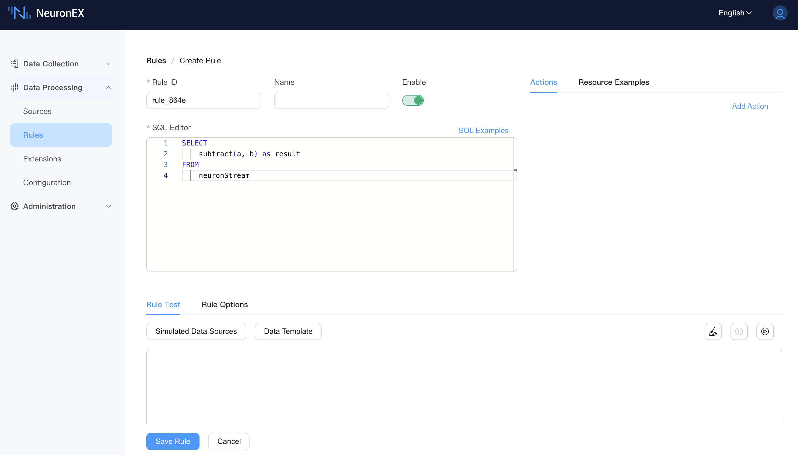

Click the **Simulated Data Sources** button, and in the popup page, select the simulated data source in SQL as `neuronStream`, set the payload content as follows, and click the **Save** button.

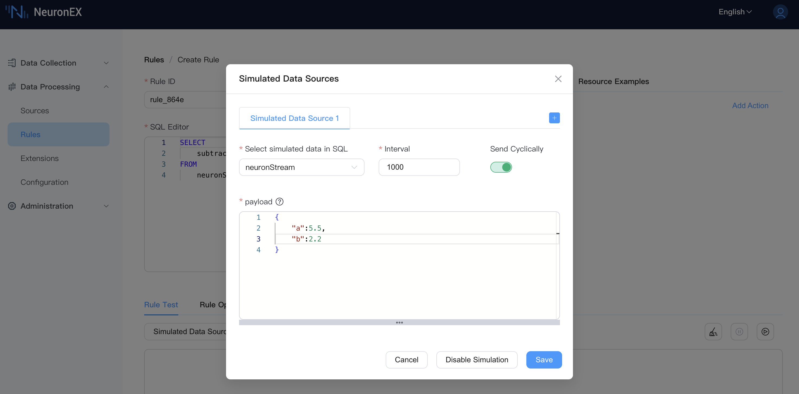

Click the **Run Test** button to see the test results in the debug output box below.

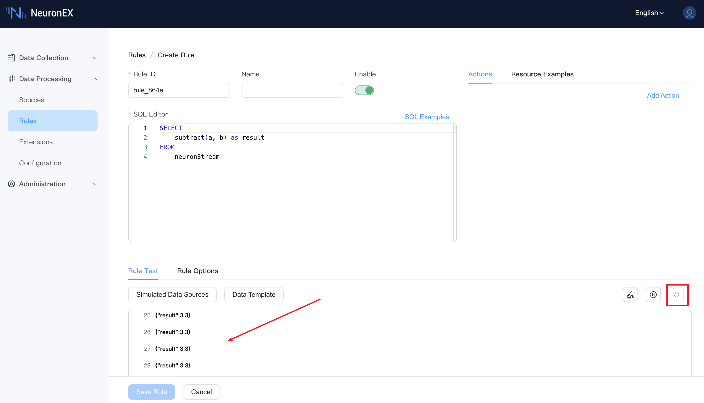

For more examples of AI-generated Python plugins in industrial scenarios, please refer to the following use cases:
- [Data Format Conversion](#data-format-conversion)
- [SPC Increment Detection](#spc-increment-detection)
- [SPC Limit Exceeding Detection](#spc-limit-exceeding-detection)

## Usage Examples

### Data Format Conversion

Data format conversion is a common data processing requirement in industrial scenarios. The AI-generated Python plugin feature can convert data to the corresponding format according to IoT platform data format requirements. For example, converting from the original input format:

```json
{
    "timestamp": 1650006388943,
    "node": "modbus",
    "group": "grp",
    "values": {
        "tag1": 123,
        "tag2": 234
    }
}
```

To the format required by the downstream IoT platform:

```json
{
  "timestamp": 1650006388943,
  "node": "modbus",
  "group": "grp",
  "tags": [{
        "name": "tag1",
        "value": 123
      },{
        "name": "tag2",
        "value": 234
      }
  ]
}
```

Dialog input as follows:

```
Generate a plugin：transform_plugin ,Implements the following functions. Converts the incoming JSON data (para1) from the original format to the target format.
## Original input format
{
    "timestamp": 1650006388943,
    "node": "modbus",
    "group": "grp",
    "values": {
        "tag1": 123,
        "tag2": 234
    }
}
## target output format
{
  "timestamp": 1650006388943,
  "node": "modbus",
  "group": "grp",
  "tags": [{
        "name": "tag1",
        "value": 123
      },{
        "name": "tag2",
        "value": 234
      }
  ]
}
```

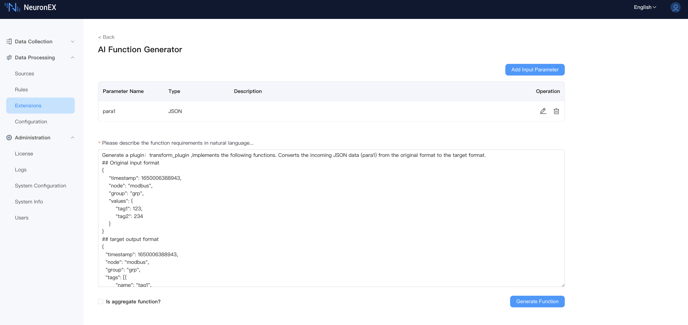

Function generation:


Calling in rules:

<div align="center">
  
</div>

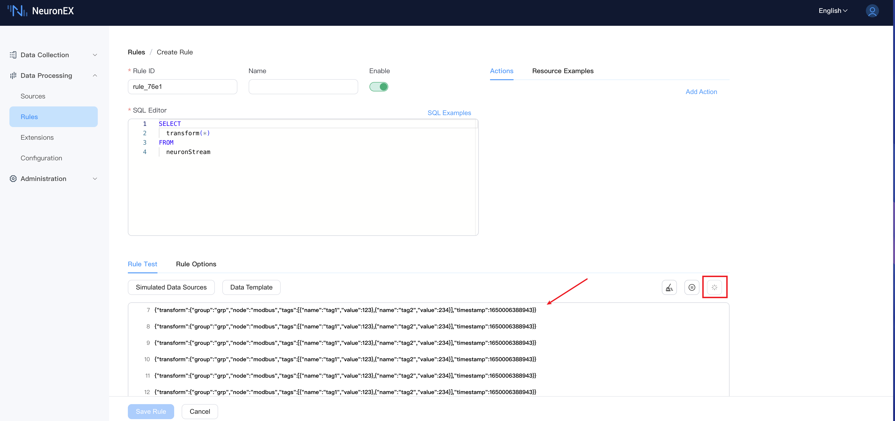

### SPC Increment Detection

SPC (Statistical Process Control) is a common data processing requirement in industrial scenarios. The AI-generated Python plugin feature can generate corresponding aggregate functions according to SPC rule requirements. 

For example, creating an plugin `agg_spc_plugin` that outputs an alert message {"alarm":"spc_error"} if the data in the array is monotonically increasing, otherwise outputs the received input content.

Dialog input as follows:

```
Generate a plugin：agg_spc_plugin,Implements the following functions. If the data in the array is monotonically increasing, output an alert message {"alarm":"spc_error"}, otherwise output the received input content.
```


:::tip
Note that you need to check the **Is Aggregate Function** option.
:::

Function generation:

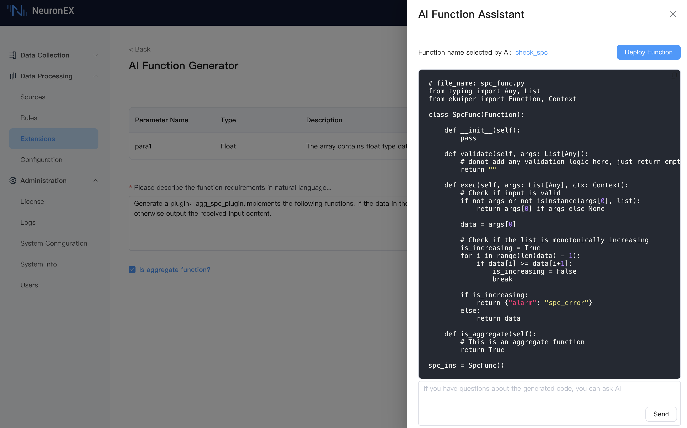

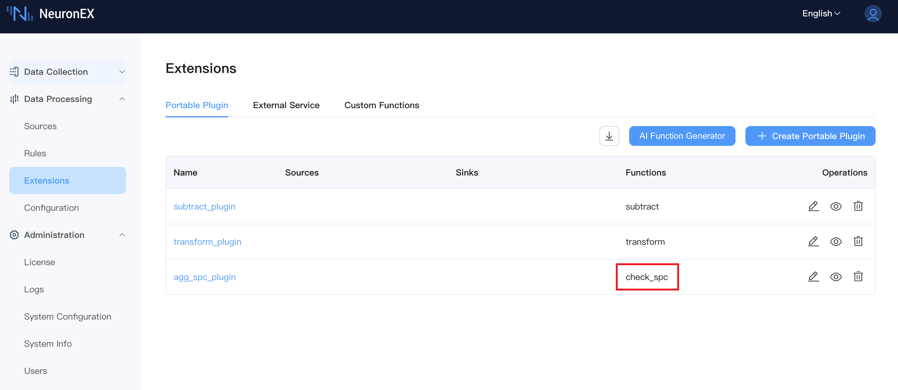

Calling in rules:

In the simulated data source, we set up an array that cyclically increases from 1.1 to 1.5.

```json
{"a":1.1}
{"a":1.2}
{"a":1.3}
{"a":1.4}
{"a":1.5}
```

<div align="center">
  
</div>

In SQL, we used a HOPPINGWINDOW with a window size of 5 and a step size of 1. 

The figure below shows the output results. Since the array is monotonically increasing, when the agg_spc function receives input [1.1,1.2,1.3,1.4,1.5], it will output the alert message {"alarm":"spc_error"}, otherwise it will output the received input content.
```sql
SELECT
  check_spc(a) as result
FROM
  neuronStream
group by
HOPPINGWINDOW(ss, 5, 1)
```

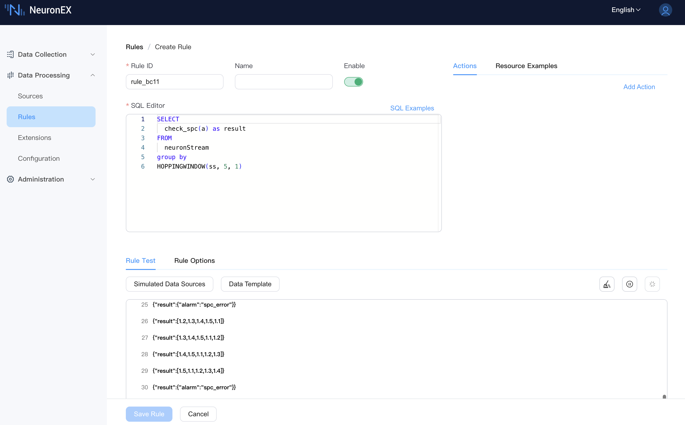

### SPC Limit Exceeding Detection

SPC (Statistical Process Control) is a common data processing requirement in industrial scenarios. The AI-generated Python plugin feature can generate corresponding aggregate functions according to SPC rule requirements. 

For example, creating an plugin `agg_spc2_plugin` that outputs an alert message {"alarm":"spc_error"} if there are more than 3 values in the array less than 1.0, otherwise outputs the received input content.

Dialog input as follows:

```
Generate a plugin：agg_spc2_plugin,Implements the following functions. If there are more than 3 values in the array less than 1.0, output an alert message {"alarm":"spc_error"}, otherwise output the received input content.
```


Function generation:

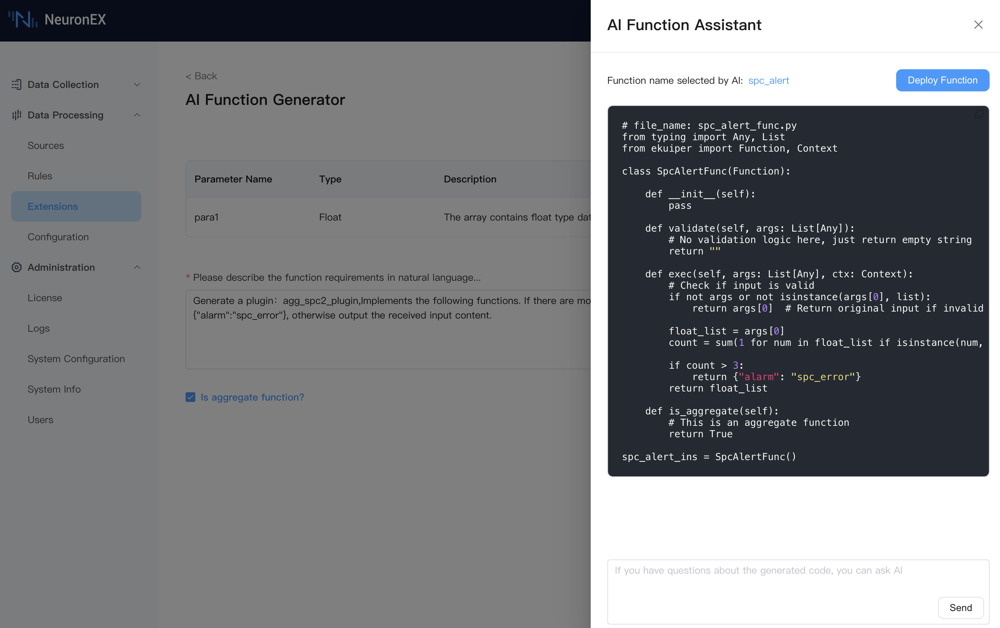


Calling in rules:

In the simulated data source, we set up json data that includes more than 3 values less than 1.0.

```json
{"a":0.2}
{"a":0.2}
{"a":0.2}
{"a":0.2}
{"a":8.8}
{"a":8.8}
{"a":8.8}
{"a":8.8}
{"a":8.8}
{"a":8.8}
```

<div align="center">
  
</div>


```sql
SELECT
  spc_alert(a) as result
FROM
  neuronStream
group by
HOPPINGWINDOW(ss, 10, 5)
```


## Summary

Through the above examples, we can see that the AI-generated Python plugin feature can quickly generate Python functions that meet specific requirements and automatically deploy them to NeuronEX for easy calling in rules. 

You can refer to the above examples and combine them with actual business requirements to generate corresponding Python functions.
