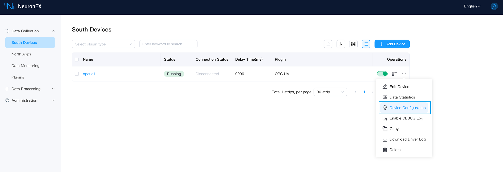
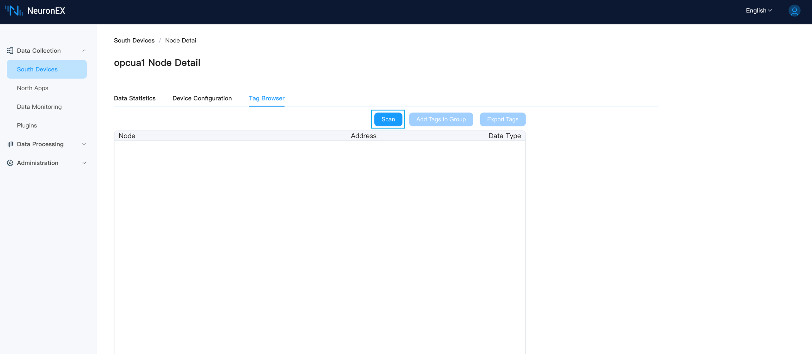
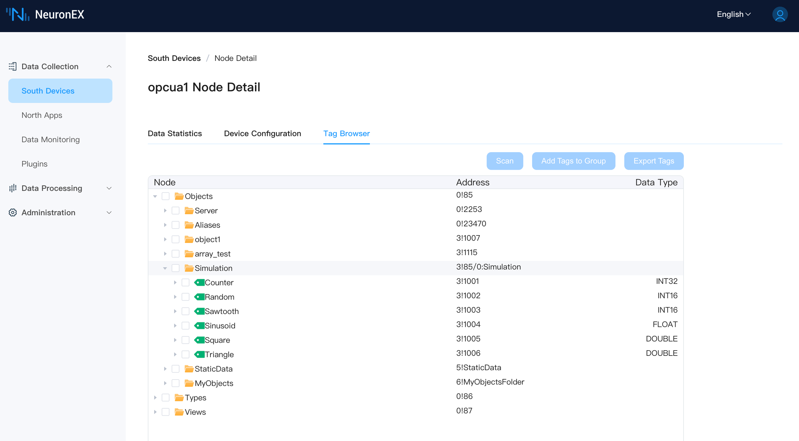
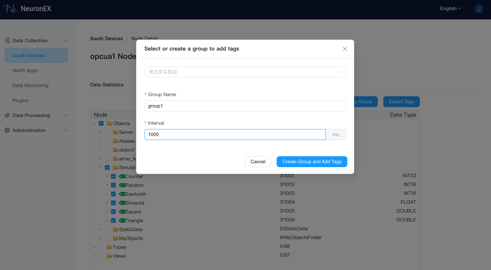
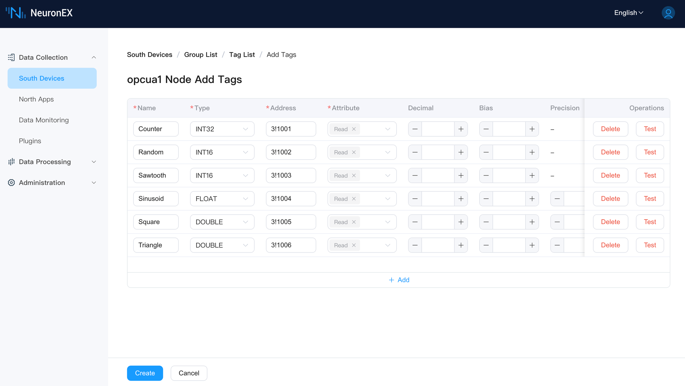
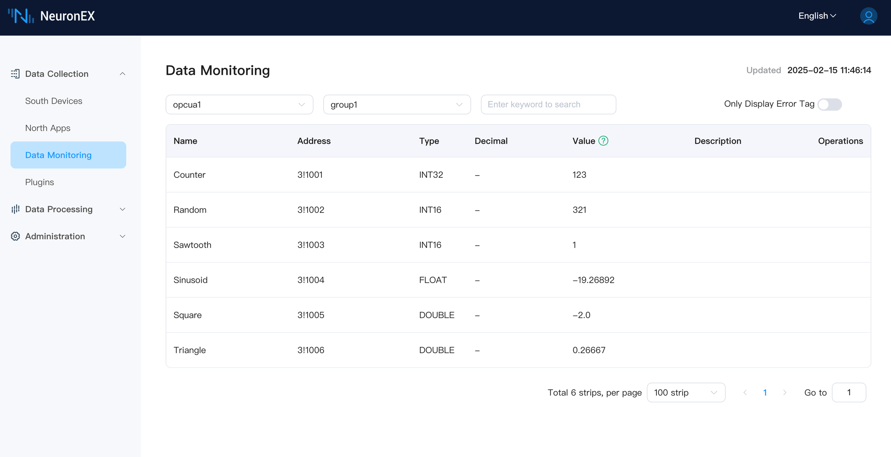

# Effectively Managing OPC UA Server Tags with NeuronEX Tag Browser Feature

## Introduction

OPC UA (OPC Unified Architecture) is a cross-platform, service-oriented communication protocol widely used in industrial automation and the Industrial Internet of Things (IIoT). It provides a standardized framework for interoperability between industrial devices and systems. As a core technology in industrial communication, OPC UA offers high security, flexibility, and scalability, making it particularly suitable for Industry 4.0 and IIoT applications. It is gradually becoming the universal standard for industrial device interoperability.

This article will introduce how NeuronEX's tag browser feature can help users manage OPC UA device tags more efficiently.

## Preparation

Before using the tag discovery feature, we need to connect an OPC UA device.

1. Log in to the NeuronEX console and navigate to the "Data Collection" -> "South Devices" page.

2. Click the "Add Device" button to go to the device addition page.

3. Select the "OPC UA" plugin and enter the OPC UA server endpoint URL.

4. Fill in the device name, for example, opcua1, and click the "Add Device" button.

Once the device is added, return to the South Devices page. You will see the newly added opcua1 device and its connection status should be "Connected."

## Tag Browser Feature

With the preparation complete, let's dive into the main topic: using the tag browser feature to efficiently manage OPC UA server tags.

### Tag Browser

1. Click the "Device Configuration" button in the operation column corresponding to the opcua1 device.

2. On the device configuration page, switch to the "Tag Browser" tab on the far right.

3. In the "Tag Browser" tab, click the "Scan" button. NeuronEX will automatically scan the OPC UA server's address space for tag information.

4. After the scan is complete, you will see the top three nodes listed in the node information.

5. Click the triangle icon in front of a node to expand and display all its child nodes. If a child node is a tag, the data type column will show the corresponding data type information.

### Add Tags to a Collection Group

If you want to add certain tags to the device's collection group, follow these steps:

1. Select the tags you want to add and click the "Add Tags to Group" button. You can also select the Simulation node to select all its child nodes.

2. In the "Select or Create a Group to Add Tags" dialog, if you want to add the tags to an existing group, simply select the group from the dropdown menu. For this example, we will create a new collection group.

3. Configure the group name (e.g., group1) and the collection interval, then click the "Create Group and Add Tags" button. You will be redirected to the tag addition page.

4. On the Add Tag page, you will see the six selected tags with their data types. You can further modify the tag names, read/write types, and other configurations. Once done, click the "Create" button to complete the tag addition.

After the tags are created, you can view real-time data collection results on the data monitoring page.

### Export Tags

To export selected tags as a tag table:

1. Return to the "Tag Browser" tab.

2. Select the tags you want to export and click the "Export Tags" button.

3. An Excel file will be downloaded to your local machine. The file will contain the relevant information of the six selected tags. After exporting the tag table, you can locally edit and save the tag information. This allows for further customization and organization of the tags according to your specific requirements. Once the edits are complete, you can import the updated tag table back into NeuronEX for use.

## Conclusion

We have now fully introduced NeuronEX's tag browser feature. With this feature, users can efficiently manage OPC UA server tags, enabling rapid integration of OPC UA devices.