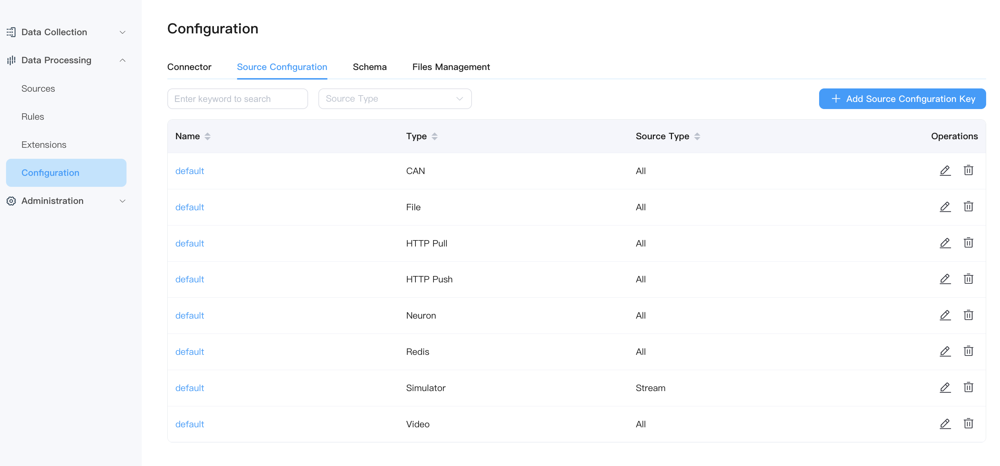
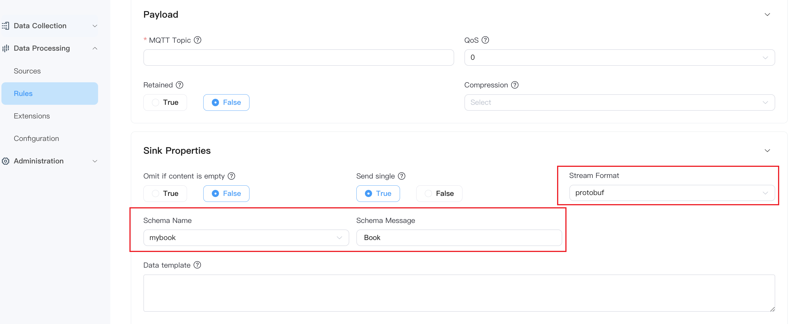
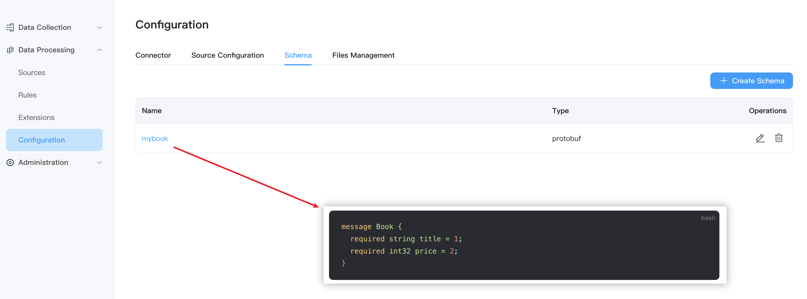

# Configuration

This page describes how to configure resources and modes for data processing functions, including four parts: `Connector`, `Source Configuration Groups`, `Schema`, and `Files Management`.


# Connector

Sources and Sinks are used to interact with external systems, both of which involve actions to connect to external resources. The complexity of different connection types varies; for example, MQTT long connections require attention to connection status, and rules may encounter disconnections during operation, necessitating complex management such as automatic reconnection. In contrast, HTTP connections are stateless by default, making status management simpler. To unify the management of complex connection resources, reuse, automatic reconnection, and obtaining connection status, an internal connection pool component was added in NeuronEX version 3.4, along with support for a series of connection types:

- MQTT Connection
- SQL Connection

Users can view added connectors on the connector page, edit related operations, or delete connectors. They can also click the **Create Connector** button in the upper right corner to add new ones. The connections created by users are entity connections that will automatically reconnect until the connection is successful.

### Connection Reuse

The connection resources created by users can run independently, and multiple rules can reference the same connection resource, including both Source and Sink sharing the same connection resource.

::: tip

NeuronEX has made compatibility changes to support exporting rules from older versions of NeuronEX and importing them on NeuronEX 3.4. The rules can still run normally. After that, you can add connectors and manually modify the Source and Sink configurations.

:::

## Source Configuration Key

Each source will have its own configuration file, and users can configure it accordingly when creating streams/tables. You can view added configurations, edit related operations, or delete configuration groups in the **Data Processing** -> **Configuration** -> **Source Configuration ** tab. You can also click the **Add Source Configuration Key** button in the upper right corner to add new ones.



## Schema

A schema is a set of metadata that defines the structure of the data. For example, the Protobuf format uses .proto files as the schema to define the transmitted data format. Currently, NeuronEX only supports protobuf and custom modes.

You can determine whether you need to define a schema based on your business scenario. This feature is suitable for scenarios where the input data type is fixed and strong validation is required.

For example, when the format of the data source is json, defining the schema information of the stream will help only the data in the schema definition to be parsed when parsing the json data. When the structure of a single piece of information in the data source is complex or large and the information required in the schema definition is clear and simple, parsing only json data will greatly reduce the processing time of a single piece of data, thus improving performance.

This section takes the Protobuf format as an example to explain how to set the codec format in NeuronEX.

### Preparation

Before starting the hands-on operation, you need to prepare the following environment:

- MQTT broker for data transmission. This tutorial uses the MQTT server located at `tcp://broker.emqx.io:1883`. `broker.emqx.io` is a public MQTT provided by [EMQ](https://www.emqx.com/en) server.
- MQTT client for observing results, such as [MQTTX](https://mqttx.app/)
- Mode .so file, NeuronEX supports both dynamic analysis and static analysis. When using dynamic parsing, users only need to specify the proto file when registering the Schema. Under conditions with higher parsing performance requirements, users can use static parsing. Static analysis requires the development of a parsing plugin. 

### Add Schema

Compared with the schemaless JSON format, Protobuf requires the data structure, that is, the schema, to be defined in advance. In the proto file, you can contain multiple message and other entity definitions, but in the configuration of the codec format, only the message definition can be used. This tutorial will use the following schema for the definition of data structures. This file defines a message structure named Book, which contains a string type title and an integer price. The transmitted data will encode and decode the binary data of the book data according to this structure.

```bash
message Book {
   required string title = 1;
   required int32 price = 2;
}
```

1. In the NeuronEX interface, click **Data Stream Processing** -> **Configuration** -> **Mode**, and click the **Create Mode** button in the upper right corner.
2. In the pop-up dialog box, follow the instructions below to make settings.
    - Schema Name: Enter the schema name, for example schema1
    - Schema Type: currently supports protobuf and custom, select protobuf
    - Schema binary file: In static parsing mode, please upload the Schema .so file
    - Schema content: Enter the Schema content through a file or directly in the text input box.

3. Click **Submit** and the newly created Schema will appear in the Schema list below.

::: tip

You can define multiple messages in a Schema. For example, the following message defines two messages: HelloRequest and HelloReply

```bash
message HelloRequest {
string name = 1;
}

message HelloReply {
string message = 1;
}
```
:::

### Using Protobuf Schema in the Sink of Rules

Taking the use of Protobuf to encode messages sent in the MQTT Sink of rules as an example, you can configure as follows on the MQTT Sink page:
- Stream Format : protobuf
- Schema Name : mybook
- Schema Message : Book



You also need to upload the protobuf file in advance on the Schema page, and the file name must match the Schema Name and Schema Message on the MQTT Sink page.



## Files Management

When adding files as data sources or through batch rules, you need to upload the prepared files to NeuronEX. The steps are as follows:

Log in to NeuronEX, click **Data Processing** -> **Configuration** -> **Files Management**, and click the **Create File** button.

NeuronEX currently supports two ways to upload configuration files: uploading files or providing file names and text content. If you choose **Custom File**, please provide both the file name in the file name field, such as `my.json`, and then upload or directly paste the file content in the file content field.

After clicking **Submit**, the file will appear in the list on the **Files Management** page, with the name containing the file path and file name, such as:

```
/opt/neuronex/data/ekuiper/data/uploads/my.json
```

