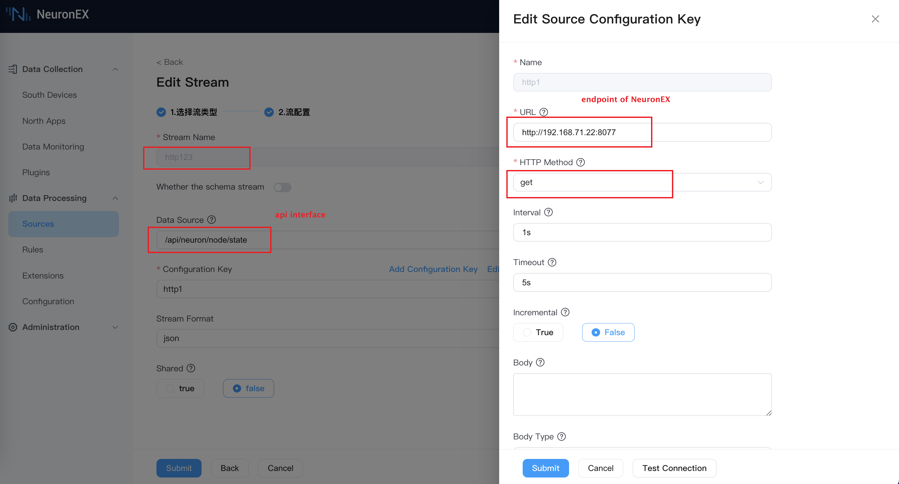
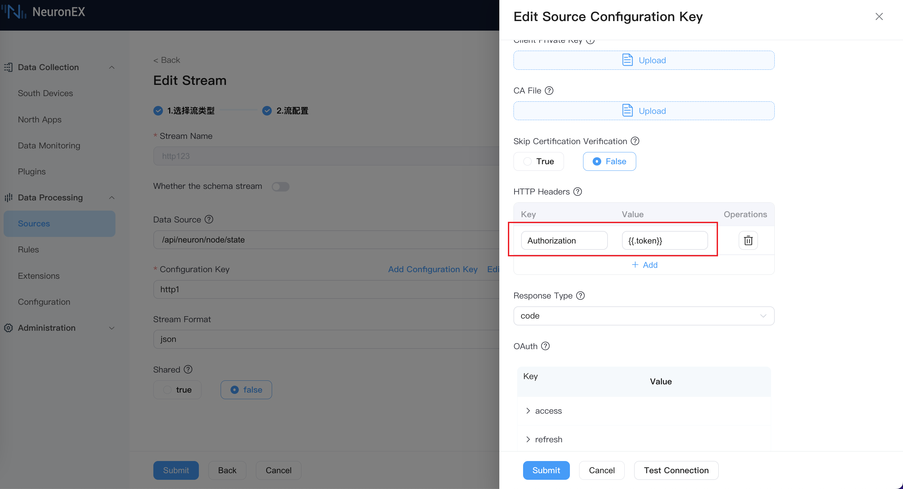
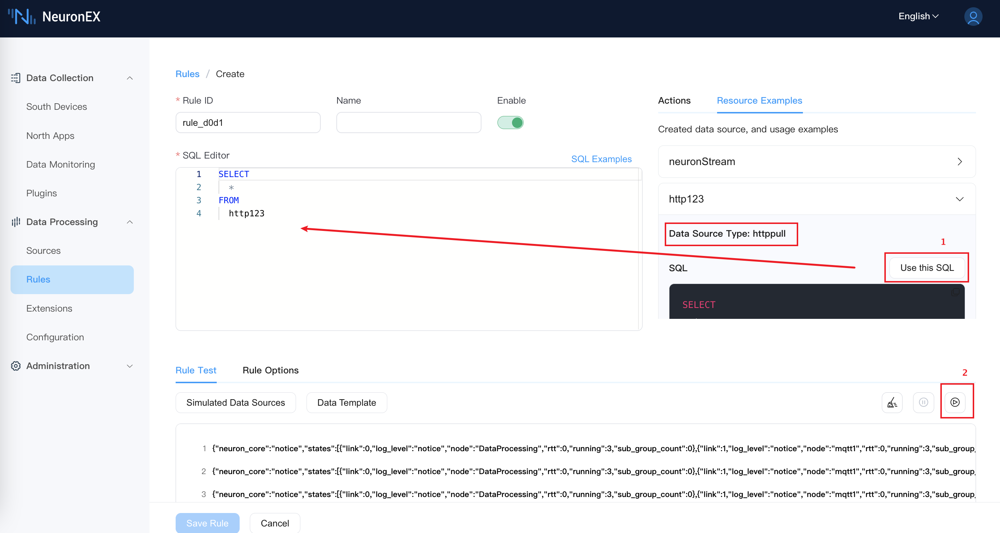

# HTTP Pull

<span style="background:green;color:white;">Stream</span>        <span style="background:green;color:white">Scan table</span>

The NeuronEX data processing module can obtain data from the HTTP server through the `HTTP Pull` type of data source, which can be used as a data source for streams and scan tables.

## Create stream

Log in to NeuronEX and click **Data Processing** -> **Source**. On the **Stream** tab, click **Create Stream**.

In the pop-up **Source**/**Create** page, enter the following configuration:

- **Stream Name**: Enter the stream name
- **Whether the schema stream**: Check to confirm whether it is a structured stream. If it is a structured stream, you need to add further stream fields. It can be unchecked by default.
- **Stream Type**: Select httppull.
- **Data source (URL Endpoint)**: The path part of the specified URL is concatenated with the `path` attribute in the configuration key to form the final URL. For example, the `path` attribute in the configuration key is filled in as `http://127.0.0.1:7000`, and the **data source (URL splicing path)** is filled in as `/api/data`, then the complete HTTP request address is :`http://127.0.0.1:7000/api/data`.
- **Configuration key**: You can use the default configuration key. If you want to customize the configuration key, you can click the Add Configuration key button and make the following settings in the pop-up dialog box.

   - **Name**: Enter the configuration key name.

   - **Path**: Specify the address of the requested server.

   - **HTTP method**: HTTP request method, which can be post, get, put or delete.

   - **Interval**: The time interval between two requests, in milliseconds.

   - **Timeout**: HTTP request timeout, in milliseconds.

   - **Increment**: If set to True, the result will be compared with the last time; if the response of two consecutive requests is the same, the new result will not be sent. The default value is False.

   - **Text**: The body of the request, for example `{"data": "data", "method": 1}`.

   - **Text type**: Text type, which can be none, text, json, html, xml, javascript or form.

   - **Certificate Type**: Optional parameter, fill in the certificate path, which can be an absolute path or a relative path. If a relative path is specified, the parent directory is the path where the neuronex command is executed. Example value: `/var/xyz-certificate.pem`

   - **Private key path**: Optional parameter, which can be an absolute path or a relative path. Example value: `/var/xyz-private.pem.key`

   - **Root Certificate Path**: Optional parameter to verify the server certificate. It can be an absolute path or a relative path. Example value: `/var/xyz-rootca.pem`

   - **Skip certificate verification**: Control whether to skip certificate verification. If set to True, certificate verification will be skipped; otherwise, certificate verification will be performed.

   - **HTTP Headers**: HTTP request headers that need to be sent with the HTTP request.

   - **Response type**: Response type, which can be `code` or `body`. If it is `code`, NeuronEX will check the HTTP response code to determine the response status. If `body` is used, NeuronEX checks the HTTP response body, requires it to be in JSON format, and checks the value of the code field. Defaults to `code`.

   - **oAuth**: Configure the OAuth verification process. 

     - access
       - url: The URL to obtain the access code, always use the POST method to access.
       - body: The request body to obtain the access token. Typically, the authorization code is provided here.
       - expire: The expiration time of the token, the time unit is seconds, templates are allowed, so it must be a string.

     - refresh
       - url: URL of the refresh token, always requested using POST method.
       - headers: Request headers used for refresh tokens. The token is usually placed here for authorization.
       - body: The request body of the refresh token. When using a header file to pass refresh tokens, you may not need to configure this option.
- **Streaming Format**: Select the default json format.
- **Shared**: Check to confirm whether to share the source.

An example configuration is as follows:
```yaml

default:
   #Request the URL of the server address
   url: http://localhost:7000
   # post, get, put, delete
   method: post
   # Interval between requests, time unit is ms
   interval: 10000
   # http request timeout, time unit is ms
   timeout: 5000
   # If it is set to true, it will be compared with the last result; if the responses of both requests are the same, sending the result will be skipped.
   # Possible settings may be: true/false
   incremental: false
   # Request body, for example '{"data": "data", "method": 1}'
   body: '{}'
   # Text type, none, text, json, html, xml, javascript, form
   bodyType: json
   # Request the required HTTP headers
   headers:
     Accept: application/json
   # How to check the response status, support through status code or body
   responseType: code
   # Get token
#oAuth:
# # Set how to obtain the access code
# access:
# # Get the URL of the access code, always use the POST method to send the request
# url: https://127.0.0.1/api/token
# # Request text
# body: '{"username": "admin","password": "123456"}'
# # The expiration time of the token, expressed as a string, the time unit is seconds, templates are allowed
# expire: '3600'
# # How to refresh token
#refresh:
# # Refresh token URL, always use POST method to send request
# url: https://127.0.0.1/api/refresh
# # HTTP request header, allowing the use of templates
# headers:
# identityId: '{{.data.identityId}}'
# token: '{{.data.token}}'
# # Request text
# body: ''


```

## Create scan table

HTTP pull sources support lookup tables. Log in to NeuronEX and click **Data Processing** -> **Source**. On the **Scan Table** tab, click **Create Scan Table**.

- **Table Name**: Enter the table name
- **Whether the schema stream**: Check to confirm whether it is a structured table. If it is a structured table, you need to add further table fields.
   - **name**: field name
   - **Type**: supports bigint, float, string, datetime, boolean, array, struct, bytea
- **Table Type**: Select httppull
- **Data source (URL Endpoint)**: The path part of the specified URL is concatenated with the `path` attribute in the configuration key to form the final URL. For example, the `path` attribute in the configuration key is filled in as `http://127.0.0.1:7000`, and **data source (URL Endpoint)** is filled in as `/api/data`, then the complete HTTP request address is :`http://127.0.0.1:7000/api/data`.
- **Configuration key**: You can use the default configuration key. If you want to customize the configuration key, please refer to the [Create Stream](#Create Stream) section
- **Table format**: supports json, binary, delimited, custom.

- **Retain Size**: Specify the Retain size.

## Example

This example uses the HTTP Pull source to read the NeuronEX API interface `/api/neuron/node/state` to obtain the southbound driver status information. In this process, it will also involve obtaining the NeuronEX Token authentication information.

In this example, the version of NeuronEX used is 3.4.1.

```shell
docker run -d --name neuronex -p 8077:8085 --log-opt max-size=100m emqx/neuronex:3.4.1
```

### Create Stream

Select **Stream** -> **Create Stream**, and on the **Create Stream** page, choose the httppull type and configure as follows:



In the following image, `.token` is the dynamically obtained NeuronEX Token authentication information, and the method to obtain it is shown in the next image.



The following image shows how to configure the obtained NeuronEX Token, which includes the following parameters:

- access
  - url: http://192.168.71.22:8077/api/login  is the NeuronEX login address
  - body: {"name":"admin","password":"0000"}  is the username and password required for NeuronEX login
  - expire: the expiration time of the token, in seconds, which is 3600 seconds


To know the return result of access, you can use the F12 browser debugging tool to find the return result of http://192.168.71.22:8077/api/login in the Network tab, where you can see the token field. This is also why the Authorization field in the second image is filled with `.token`. (You can also test this using Postman.)


The reason for configuring the Authorization field in the second image is that NeuronEX automatically enables authentication by default, so manual configuration is required. You can find the Authorization field in the Headers of each NeuronEX API request using the F12 browser debugging tool.


::: tip

In this example, the NeuronEX port used is 8077. If you are using the default port 8085, please replace the port with 8085 in all configurations.

:::

### View stream results

Select **Rules** -> **Create Rule**, on the **Create Rule** page, choose the stream `http123` created in the previous step, and enable rule debugging. You will be able to see the southbound driver status information obtained from the NeuronEX API interface `/api/neuron/node/state`, indicating that the http pull source has successfully retrieved data.

