# AI 生成 Python 插件最佳实践指南

## 文档目的

本指南旨在帮助 NeuronEX 用户，特别是运维人员或自动化工程师，有效地利用 NeuronEX 集成的 AI 能力(结合 LLM 模型)生成 Python 函数插件，以应对 NeuronEX SQL 难以处理的复杂边缘数据处理逻辑。遵循这些最佳实践，可以确保生成的代码功能正确、性能良好、易于维护，并充分发挥 NeuronEX 在工业边缘计算场景中的潜力。

## 背景

NeuronEX 提供了强大的流式 SQL 处理能力，可以满足大部分工业数据在边缘端的清洗、转换、聚合和告警需求。然而，面对如状态维持判断（如连续递增检测）、复杂格式转换、特定业务逻辑计算等场景时，SQL 的表达能力受限。

NeuronEX 支持通过 Python 等语言编写扩展函数来弥补这一不足，但这传统上需要用户具备编程技能并处理开发、调试、部署等流程。通过集成 DeepSeek LLM，NeuronEX 实现了 “**自然语言描述** -> **AI 生成 Python 代码** -> **自动部署** -> **SQL 调用**” 的简化流程，极大地降低了开发门槛，提高了响应速度。

## 功能介绍

在 NeuronEX 上使用 AI 生成 Python 插件功能，主要涉及以下几个步骤：安装、配置 AI 模型、使用 AI 生成函数功能、以及在规则中测试和使用生成的插件。

### 安装

NeuronEX 从 3.5.1 版本开始，提供了支持 AI 功能 Docker 镜像包 neuronex:3.5.1-ai 和 neuronex:3.5.1-ai-amd64。该镜像包已预装了与 LLM 模型交互所需的 Python 依赖库。

使用以下命令下载并运行 NeuronEX

```shell
# 下载x86镜像，并运行容器
docker pull emqx/neuronex:3.5.1-ai
docker run -d --name neuronex -p 8085:8085 --log-opt max-size=100m --privileged=true emqx/neuronex:3.5.1-ai

# 下载arm64镜像，并运行容器
docker pull emqx/neuronex:3.5.1-ai-amd64
docker run -d --name neuronex -p 8085:8085 --log-opt max-size=100m --privileged=true emqx/neuronex:3.5.1-ai-amd64

```

### AI 模型配置

在使用 AI 生成 Python 插件功能之前，您需要先在 NeuronEX **系统配置** -> **AI 模型配置**页面，添加一个LLM模型配置信息，包括 LLM 模型的类型、API Key、Endpoint 地址以及模型名称。目前 NeuronEX 已支持以下厂商的模型：

| <div style="width:100pt">模型厂商</div>                 | <div style="width:120pt">Endpoint地址</div> | <div style="width:120pt">模型名称</div> |
| ------------------------------------------------------------ |  ------------ | -------------------------------- |
| DeepSeek              | `https://api.deepseek.com`  | `deepseek-chat` <br> `deepseek-reasoner` |
| SiliconFlow              | -    |  `Pro/deepseek-ai/DeepSeek-V3` <br> `Pro/deepseek-ai/DeepSeek-R1`|
| OpenAI     | `https://api.openai.com/v1`  |  `gpt-4o` |
| Azure OpenAI            | Azure官网获取  |  `gpt-4o` |

您可通过以上模型厂商的官方网站获取 API Key，并在 NeuronEX 页面添加模型配置并启用。可在页面中同时配置多个大模型，但只能启用一个模型进行使用。


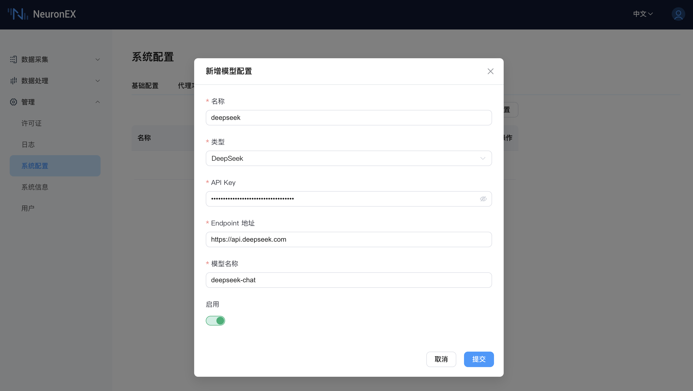

::: tip
1. 请保证 NeuronEX 能正常联网，可访问大模型的 API。
2. 小模型或者过于老旧的模型会影响生成 Python 插件的效果，上表中的模型为推荐使用模型，后续也可使用各厂商推出的新模型。
:::


### AI 生成 Python 插件

配置好 LLM 模型后，在 NeuronEX **数据处理** -> **算法集成**页面，点击**AI生成函数**，进入AI生成函数页面：


在 AI 生成函数页面，您可以输入自然语言描述您想要生成的 Python 函数，以简单的数学运算为例，您可以输入：

```
请生成一个 Python 函数，计算两个数a减b的结果
```

为了提高大模型生成代码的准确性，您可以点击**添加输入参数**按钮，对输入的类型进行描述，如下：

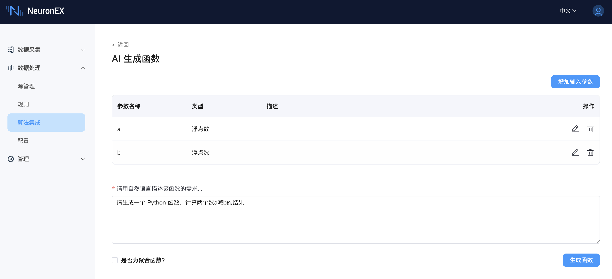

点击**生成函数**按钮，大模型会根据您的描述生成 Python 代码，并展示在弹出的 AI 对话框中，这个过程需要等待几秒，请参照进度条耐心等待。

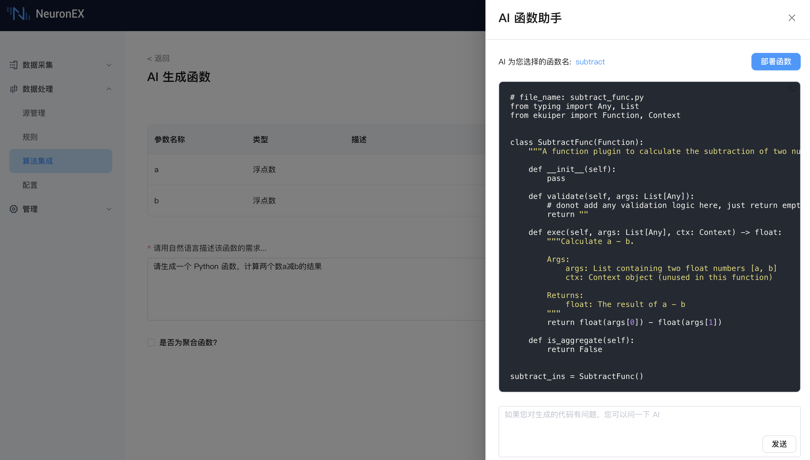

点击上图的**部署函数**按钮，生成的 Python 代码会自动部署到 NeuronEX 中，弹框提示部署成功。如果您对生成的代码有疑问，也可以在 AI 对话框中进行提问。


在算法集成列表页看到当前已被部署的函数`subtract`：


::: tip
1. 和 AI 对话并不能调整生成的函数代码逻辑，如果对生成的插件函数不满意，可再次输入并调整自然语言，重新生成。
2. 如果 AI 生成的便捷插件与已有便捷插件名称重名，则原便捷插件会被覆盖。
3. 如果 AI 生成的便捷插件与内置函数名称重名，则内置函数优先级更高，生成插件无效。
:::

关于`是否为聚合函数`的使用，请参考[SPC 递增检测](#spc-递增检测)和[SPC 超限检测](#spc-超限检测)。

### 插件测试使用

在**数据处理** -> **规则**页面，点击**新建规则**按钮，进入新建规则页面，在 SQL 语句中调用生成的便捷插件，并测试使用。

```sql
SELECT 
    subtract(a, b) as result
FROM 
    neuronStream
```
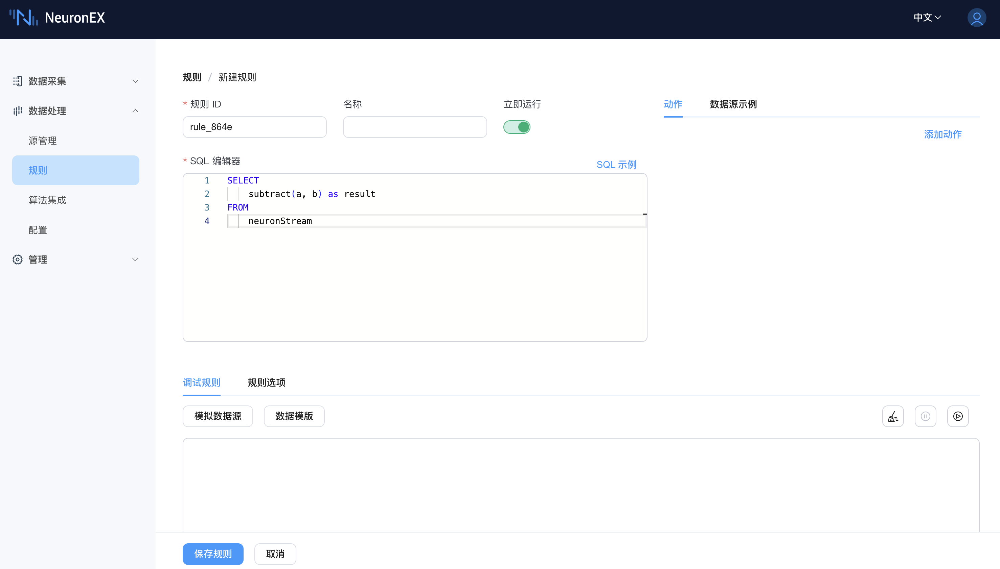

点击**模拟数据源**按钮，在弹出的模拟数据源页面，选择 SQL 中模拟数据源为`neuronStream`，payload内容设置如下，点击**保存**按钮。

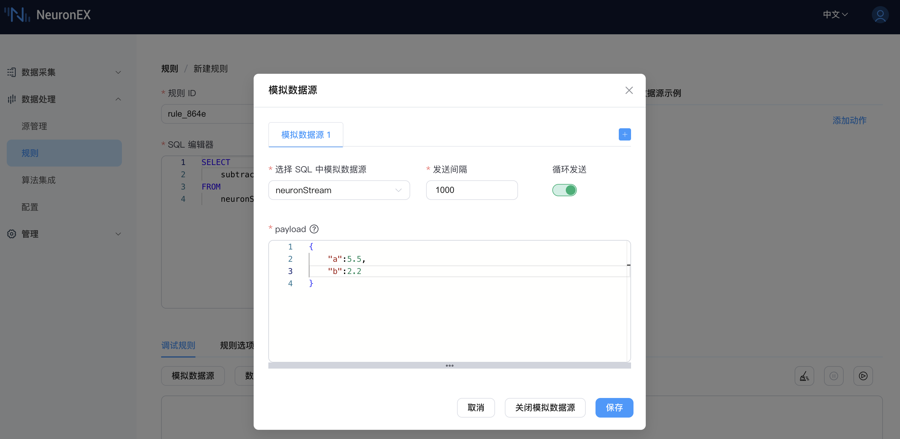

点击**运行测试**按钮，即可在下方调试输出框，看到测试结果。

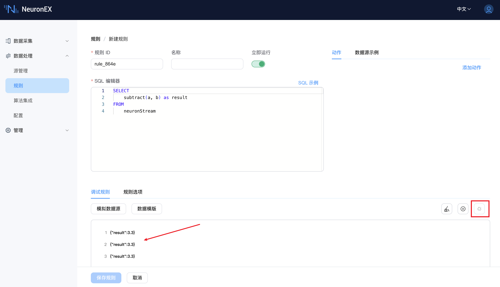

更多的工业场景下的 AI 生成 Python 插件用法，请参考以下使用示例：
- [数据格式转换](#数据格式转换)
- [SPC 递增检测](#spc-递增检测)
- [SPC 超限检测](#spc-超限检测)

## 使用示例

### 数据格式转换

数据格式转换是工业场景中常见的数据处理需求，AI 生成Python插件功能，可根据下游 IoT 平台数据格式要求，将数据转换为对应格式。下面举例说明，将原始输入格式：

```json
{
    "timestamp": 1650006388943,
    "node": "modbus",
    "group": "grp",
    "values": {
        "tag1": 123,
        "tag2": 234
    }
}

```

转换为下游 IoT 平台要求的格式：

```json
{
  "timestamp": 1650006388943,
  "node": "modbus",
  "group": "grp",
  "tags": [{
        "name": "tag1",
        "value": 123
      },{
        "name": "tag2",
        "value": 234
      }
  ]
}
```

对话输入如下：

```
实现以下功能,将输入的 JSON 数据 (para1) 从原始格式转换为目标格式。
## 原始输入格式
{
    "timestamp": 1650006388943,
    "node": "modbus",
    "group": "grp",
    "values": {
        "tag1": 123,
        "tag2": 234
    }
}
## 目标输出格式
{
  "timestamp": 1650006388943,
  "node": "modbus",
  "group": "grp",
  "tags": [{
        "name": "tag1",
        "value": 123
      },{
        "name": "tag2",
        "value": 234
      }
  ]
}

```

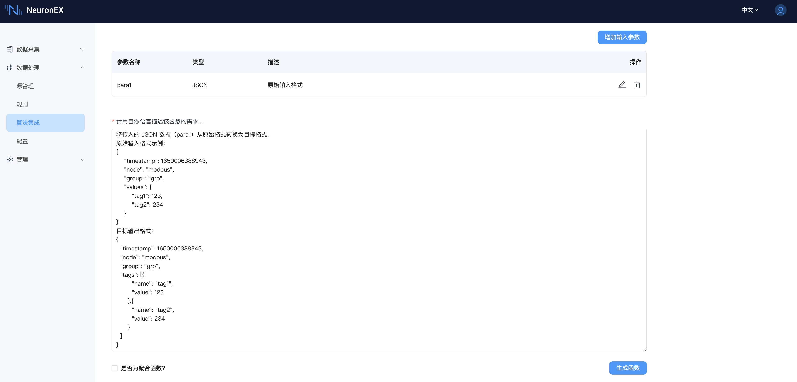

函数生成：

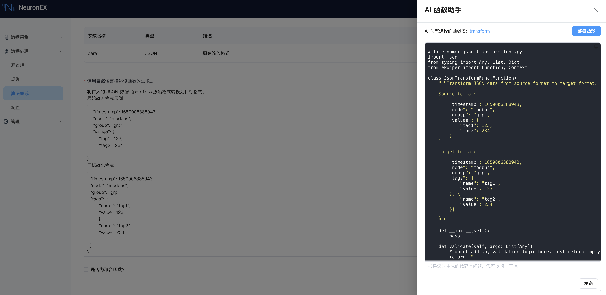


在规则中调用：


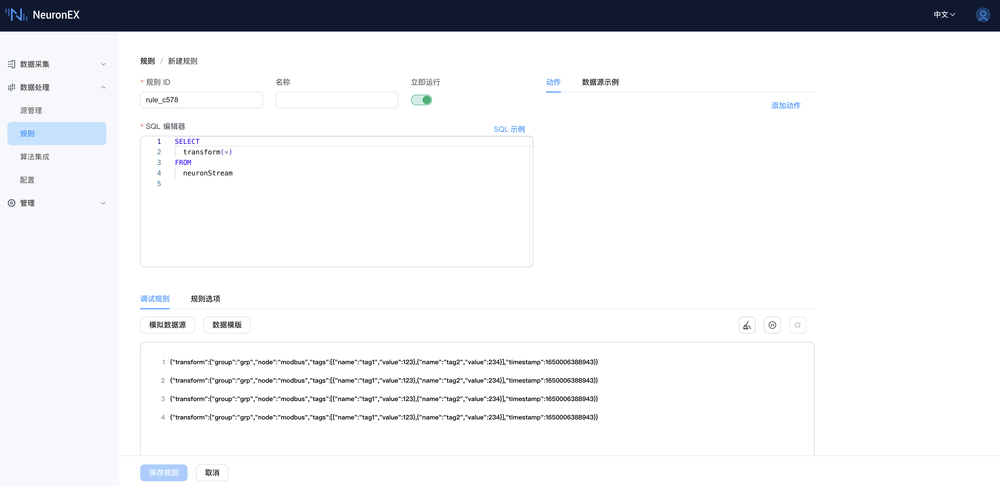


### SPC 递增检测

SPC(Statistical Process Control) 统计过程控制，是工业场景中常见的数据处理需求，AI 生成Python插件功能，可根据 SPC 规则要求，生成对应的聚合函数。下面举例说明，创建一个聚合函数agg_spc,如果数组中的数据单调递增，则输出告警信息{"alarm":"spc_error"},否则输出收到的输入内容。

对话输入如下：

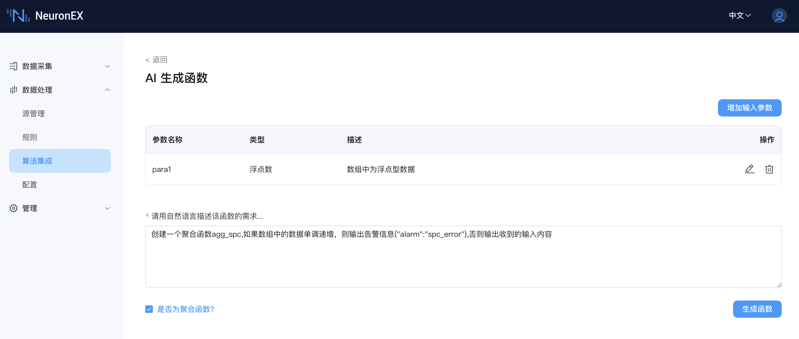

:::tip
注意，需要勾选**是否为聚合函数**。
:::

函数生成：

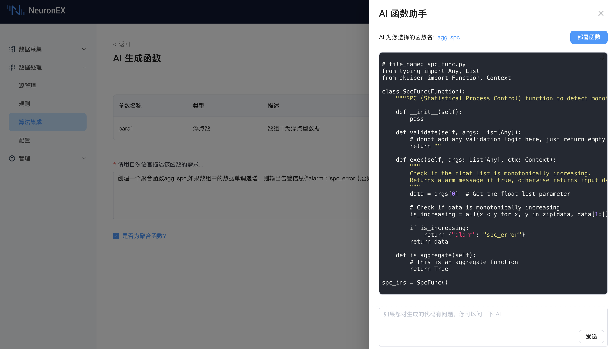

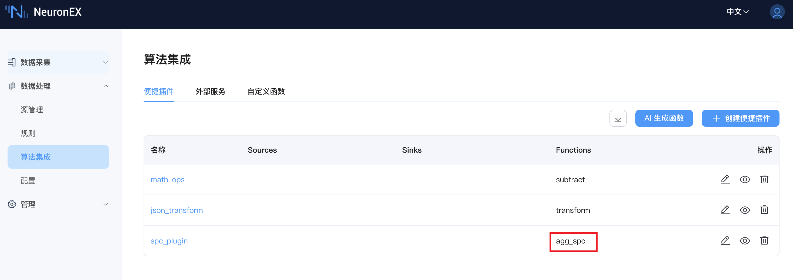

在规则中调用：

在模拟数据源中，我们设置了一个从1.1到1.5循环递增的数组。

```json
{"a":1.1}
{"a":1.2}
{"a":1.3}
{"a":1.4}
{"a":1.5}
```


在 SQL 中我们使用了 HOPPINGWINDOW 窗口，窗口大小为5，步长为1，下图为输出结果。由于数组是单调递增的，当agg_spc函数收到输入[1.1,1.2,1.3,1.4,1.5]后，会输出告警信息{"alarm":"spc_error"}，否则输出收到的输入内容。

```sql
SELECT
  agg_spc(a) as result
FROM
  neuronStream
group by
HOPPINGWINDOW(ss, 5, 1)
```

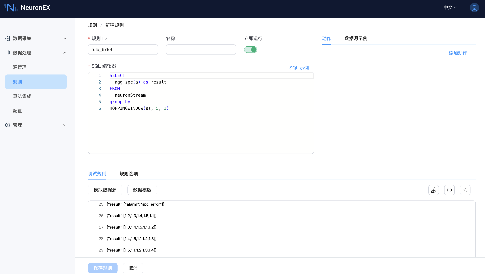


### SPC 超限检测

SPC(Statistical Process Control) 统计过程控制，是工业场景中常见的数据处理需求，AI 生成Python插件功能，可根据 SPC 规则要求，生成对应的聚合函数。下面举例说明，创建一个聚合函数agg_spc2,如果数组中的数据有超过3个值小于1.0，则输出告警信息{"alarm":"spc_error"},否则输出收到的输入内容。

对话输入如下：


函数生成：

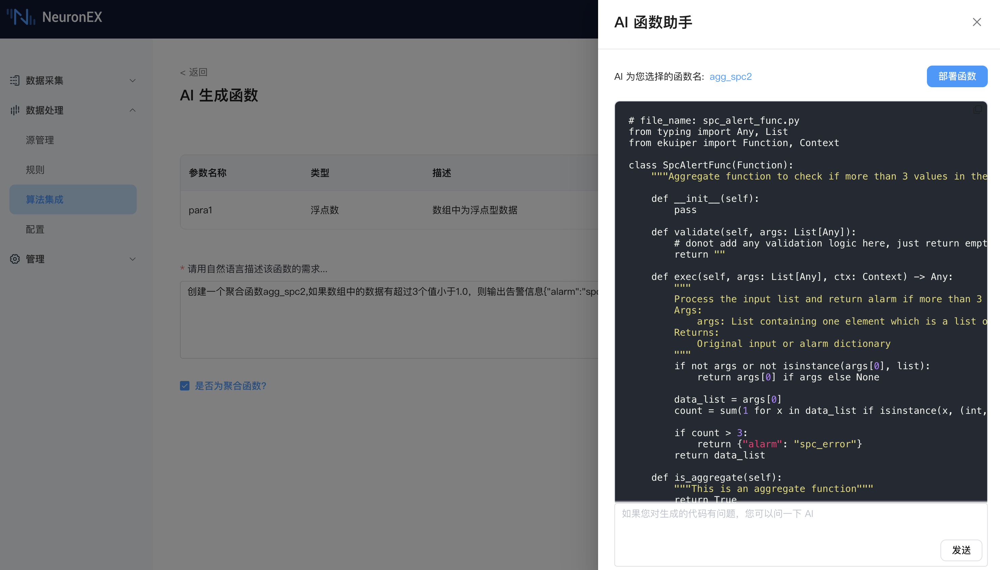

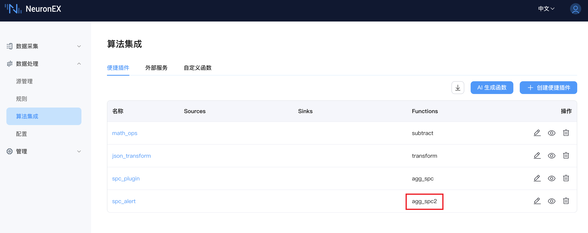

在规则中调用：


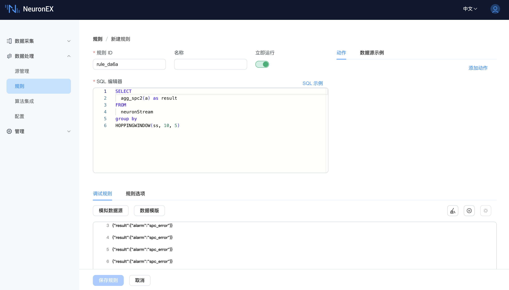


## 总结

通过以上示例，我们可以看到，AI 生成 Python 插件功能，可以快速生成满足特定需求的 Python 函数，并自动部署到 NeuronEX 中，方便在规则中调用。您可以参考以上示例，结合实际业务需求，生成对应的 Python 函数。