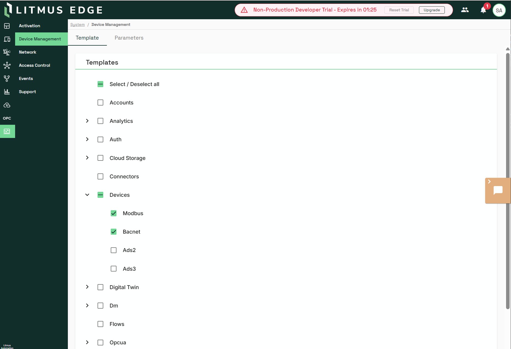

# Litmus Edge 到 EMQX Neuron 迁移指南

## 概述

- **迁移目标**：将 Litmus Edge （V4.0 及以上版本） 侧采集配置转换为 EMQX Neuron 可导入的配置。

- **转换方式**：使用 EMQ 官网提供的[在线配置转换工具](https://www.emqx.com/zh/products/emqx-neuron/migrator)。

## 支持的转换协议

| Litmus Edge 协议            | 是否支持 | 备注  |
| ------------------------- | ---- | --- |
| Modbus RTU over TCP       | 支持   |     |
| Modbus RTU                | 支持   |     |
| Modbus ASCII              | 支持   |     |
| OPC UA Client (Gen1)      | 支持   |     |
| OPC UA Client Poll (Gen2) | 支持   |     |
| Allen-Bradley DF1         | 支持   |     |
| Omron FINS TCP            | 支持   |     |
| Omron FINS UDP            | 支持   |     |
| Omron Hostlink C-Mode     | 支持   |     |
| Siemens S7 / S7 Advanced  | 支持   |     |
| BACnet/IP                 | 支持   |     |

:::tip
未列出的协议暂不支持转换。
:::

## 在 Litmus Edge 上如何获取配置文件

按下列步骤在 Litmus Edge 中导出配置。

- 登录 Litmus Edge 管理界面，打开 System/Device Management

- 选择 Devices 下要迁移的设备

- 下载模板，格式选择 `Plain Text`。

导出文件需包含设备（Device）、寄存器/点位（Register）等可供映射的结构；具体字段以 Litmus Edge 导出为准。

## 官网转换工具

### 上传与转换

- 打开[官网迁移工具页面](https://www.emqx.com/zh/products/emqx-neuron/migrator)。选择来源为 **Litmus Edge。**

- 上传在 [Litmus Edge](#在-litmus-edge-上如何获取配置文件) 得到的导出文件。

- 等待服务端完成转换，查看汇总结果（设备数、标签成功/失败统计等）。

- 点击下载 EMQX Neuron 配置 JSON 按钮，下载转换后的配置文件。

### 转换失败场景

下载 EMQX Neuron 配置 JSON 时，未成功转换的设备（例如不支持的驱动）及点位会被自动排除，文件中仅包含已转换成功的设备与其点位。

展开设备后，可详细查看转换失败原因：

| **点位名**      | **类型** | **地址** | **状态** | **失败原因** |
| ------------ | ------ | ------ | ------ | -------- |
| outputuint64 | uint64 | H:0    | OK     | -        |
| inputstring  | string | I:0    | 失败     | 字符串长度超限  |

## EMQX Neuron 侧导入与验证

- 确保 EMQX Neuron 和 Litmus Edge 部署在同一网络下，也即 EMQX Neuron 能访问到 Litmus Edge 对应采集的设备。

- 登录 EMQX Neuron Dashboard 界面。

- 在数据采集模块的南向设备页面，点击「导入」按钮。

- 查看导入驱动连接状态，确保连接成功。

- 在数据监控页面查看采集数据，确保数据正常。

## 转换协议详细说明

### 分组策略

**EMQX Neuron** 支持在单个驱动下配置多个采集组，每个采集组可以配置不同的采集间隔，采集组下的点位不可单独配置采集间隔。

**Litmus Edge** 侧无与 **EMQX Neuron** 完全一致的 `group` 概念，设备下 Register 为平铺结构。本转换工具采用：每个设备下所有点位放入同一分组，分组名为 `default`；该分组采集间隔取该设备下所有点位 `pollingInterval` 的最小值。若需在生产中拆分为多组，请在 EMQX Neuron 中手动调整分组与采集频率。

## 支持的转换协议的特殊说明

### 1. 协议名称 Modbus TCP

- **设备（Device）映射**

| Litmus Edge 字段                      | EMQX Neuron 字段              | 说明                                  |
| ----------------------------------- | --------------------------- | ----------------------------------- |
| `Dev.name`                          | `name`                      | 设备节点名                               |
| 固定值                                 | `plugin: "Modbus TCP"`      | 插件名                                 |
| `settings.networkAddress`           | `params.host`               | IP 地址                               |
| `settings.networkPort`              | `params.port`               | 端口                                  |
| `settings.stationId`                | tag 地址中的 `slave_id`         | 从站 ID                               |
| `settings["Zero-Based Addressing"]` | `params.address_base`       | `"1"` → base_0(0)；`"0"` → base_1(1) |
| 固定值                                 | `params.connection_mode: 0` | 客户端模式                               |
| 固定值                                 | `params.timeout: 3000`      | 连接超时（ms，以产品为准）                      |
| 固定值                                 | `params.interval: 20`       | 发送间隔（以产品为准）                         |

- **寄存器区域映射（Litmus Edge Register.name 前缀 → EMQX Neuron area code）**

| Litmus Edge `name` 前缀    | EMQX Neuron 区域码 | 含义                    |
| ------------------------ | --------------- | --------------------- |
| `C`                      | 0               | Coil（线圈）              |
| `D`                      | 1               | Discrete Input（离散输入）  |
| `I`, `I_bit`, `I_String` | 3               | Input Register（输入寄存器） |
| `H`, `H_bit`, `H_String` | 4               | Hold Register（保持寄存器）  |

- **数据类型映射（Litmus Edge value_type → EMQX Neuron type）**

| Litmus Edge `value_type` | EMQX Neuron type | 值   |
| ------------------------ | ---------------- | --- |
| bit                      | NEU_TYPE_BIT     | 11  |
| int16                    | NEU_TYPE_INT16   | 3   |
| uint16                   | NEU_TYPE_UINT16  | 4   |
| int32                    | NEU_TYPE_INT32   | 5   |
| uint32                   | NEU_TYPE_UINT32  | 6   |
| int64                    | NEU_TYPE_INT64   | 7   |
| uint64                   | NEU_TYPE_UINT64  | 8   |
| float32                  | NEU_TYPE_FLOAT   | 9   |
| float64                  | NEU_TYPE_DOUBLE  | 10  |
| word                     | NEU_TYPE_UINT16  | 4   |
| string                   | NEU_TYPE_STRING  | 13  |

- **读写属性（区域 → EMQX Neuron attribute）**

| Litmus Edge 区域             | EMQX Neuron attribute | 说明                    |
| -------------------------- | --------------------- | --------------------- |
| Coil (C)                   | 3（Read+Write）         | 可读可写                  |
| Discrete Input (D)         | 1（Read）               | 只读                    |
| Hold Register (H)          | 3（Read+Write）         | 可读可写                  |
| Input Register (I)         | 1（Read）               | 只读                    |
| Hold Register Bit (H_bit)  | 1（Read）               | EMQX Neuron 不支持寄存器位写入 |
| Input Register Bit (I_bit) | 1（Read）               | 只读                    |

- **字节序（4字节）**

| Litmus Edge `endianness` | EMQX Neuron 4 字节（endianess） | EMQX Neuron 地址后缀 |
| ------------------------ | --------------------------- | ---------------- |
| `"AB CD"`                | ABCD (1)                    | `#BB` / 无后缀      |
| `"BA DC"`                | BADC (2)                    | `#LB`            |
| `"CD AB"`                | CDAB (4)                    | `#BL`            |
| `"DC BA"`                | DCBA (3)                    | `#LL`            |

- **字节序（8字节）**

| Litmus Edge `endianness` | EMQX Neuron 8 字节 |
| ------------------------ | ---------------- |
| `"AB CD"`                | LL (1)           |
| `"BA DC"`                | LB (2)           |
| `"DC BA"`                | BB (3)           |
| `"CD AB"`                | BL (4)           |

- **点位地址格式与寻址规则**

EMQX Neuron Modbus TCP 地址格式：`{slave_id}!{area_code}{address}`

  1) **普通数值**：1!40000（slave_id=1，Hold Register，address=0）

  2) **字符串**：1!40000.55H（在地址 0 处 55 字节字符串，示例）

  3) **寄存器位**：1!40000.0（Hold Register 地址 0 的第 0 位）

**与 Litmus Edge settings["Zero-Based Addressing"] 的关系**：

  1) `"1"`（zero-based）→ EMQX Neuron address_base = 0，地址直接使用

  2) `"0"`（one-based）→ EMQX Neuron address_base = 1，地址 +1

**与 Litmus Edge 侧字段对应关系**：上表即迁移工具所用映射；若 Litmus Edge 导出字段有变更，以工具版本说明为准。

