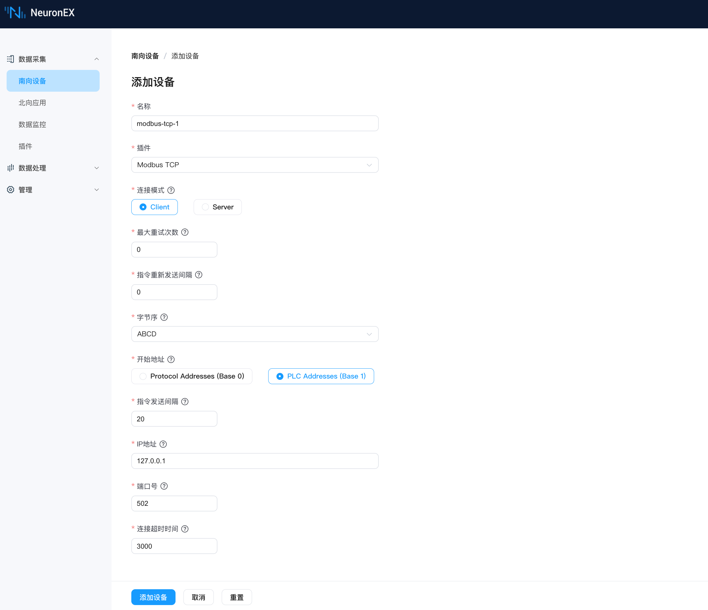
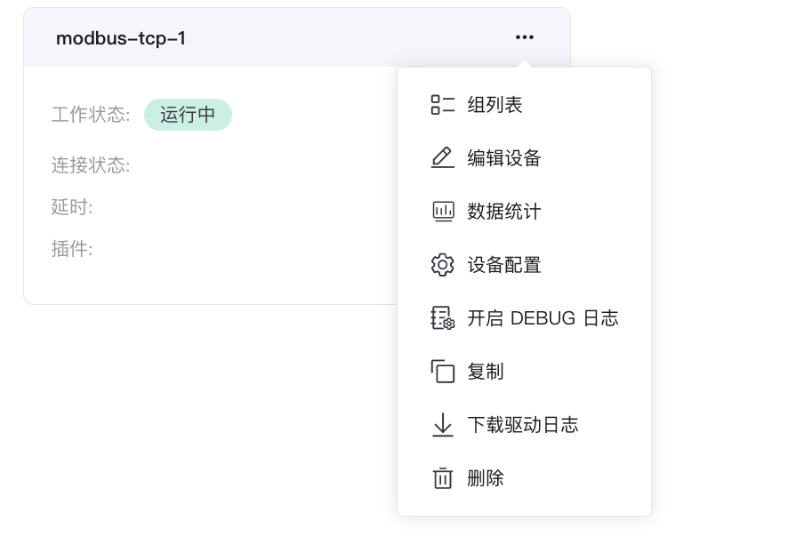
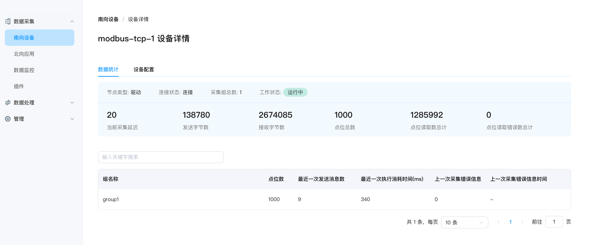

# 创建南向驱动

本章将介绍如何通过 NeuronEX 对接各种工业协议，实现对各类南向设备的数据采集。将通过演示 ModbusTCP 南向设备的添加和配置流程进行说明。

## 添加南向设备

创建南向驱动节点，用于连接到真实设备或模拟器。

在 **数据采集 -> 南向设备**，点击**添加设备**来创建设备节点，这里将选择 ModbusTCP 插件为例进行演示。

* **名称**：输入设备名称，例如 `modbus-tcp-1`。
* **插件**：选择 **Modbus TCP** 插件。
* **连接模式**：选择以太网 TCP 连接时，可以选择 NeuronEX 作为 TCP 的客户端或是服务端。
* **最大重试次数**：发送读指令失败后最大重试次数。
* **指令发送间隔**：发送每条读写指令之间的等待时间。单位为毫秒。注意：如间隔时间设置较小，某些串口设备在较短时间内接收到连续指令时，可能会丢弃某些指令，因此请合理设置该参数。
* **字节序**：选择字节序，默认为 `1234`。
* **开始地址**：Modbus 的地址从 1 开始或从 0 开始。
* **指令发送间隔**：发送指令的间隔时间，单位为毫秒。
* **IP 地址**：填写目标设备 IP。
* **端口号**：填写 Modbus设备的端口，默认为 502 端口。
* **连接超时时间**：单位 ms，默认为 3000，超过设置时间未接收到消息则报错。

* 点击**添加设备**，完成设备配置。



点击**添加设备**后，在**南向设备**页面，可以看到该节点的驱动卡片。包含了该设备的工作状态、连接状态以及操作等信息。

## 驱动卡片

在**南向设备**页，在右上角可以选择以列表或卡片方式展示南向设备，这里将以驱动卡片为例介绍其中各选项的含义。

* **名称**：名称为南向设备提供的唯一名称。
* **组列表**：进入该设备的采集组页面。
* **编辑设备**：修改南向设备的唯一名称。
* **数据统计**：查看该南向驱动的详细运行信息。
* **设备配置**：点击该按钮进入配置界面，用于设置 NeuronEX 连接南向设备所需的参数设置。
* **开启 DEBUG 日志**：开启当前驱动节点的 DEBUG 级别日志，开启 DEBUG 日志后，再次点击该按钮，将关闭 DEBUG 日志。
* **复制**：复制该驱动节点，包含配置信息和点位配置信息。
* **下载驱动日志**：下载该驱动节点的日志。
* **删除**：从南向设备列表中删除该节点。
* **工作状态**：显示驱动节点的当前状态，目前节点分为以下几种工作状态：
    * **初始化**：驱动创建后的初始状态，表示配置有误，无法正常运行，需要修改驱动配置。
    * **运行中**：驱动节点正常运行。
    * **停止**：驱动节点停止运行。
* **工作状态切换按钮**：是否打开与设备的连接：
    * 打开：NeuronEX 与设备/应用建立连接，开始收集数据。
    * 关闭：断开设备连接，停止收集数据。
* **连接状态**：显示设备的连接状态。设置组和标签后，NeuronEX 会连接设备采集数据，状态自动切换为**连接**，若NeuronEX无法和设备建立连接，则连接状态显示为**断开**。
* **延时**：发送和接收指令之间的时间间隔。
* **插件**：该设备使用的插件模块名称。



## 创建采集组和点位

### 创建采集组

创建采集组，同一个组的数据以相同的频率进行采集以及上报。

点击新增的设备节点，进入组列表管理界面，点击 `创建组` 来创建采集组。

* **名称**：填入组的名称，比如 group-1。
* **时间间隔**：这组点位的采集和上报频率，以毫秒为单位，100 表示每 100ms 采集一次，整组点位的值上报一次。

:::tip
NeuronEX 支持通过 Excel 文件批量实现组和数据标签点位的配置，具体可参考[批量点位配置](#批量点位配置)。
:::

### 在组中添加数据点

添加需要采集的设备点位，包括点位地址，点位属性，数据类型等。

点击组中的 `点位列表` 按钮，进入点位列表界面。

点击 `添加点位` 按钮，进入添加标签页面，如下图所示。


* **名称**：填写点位名称，可自定义，例如，tag1；
* **类型**：下拉选择数据类型，例如 int16，uint16，int32，uint32，float，bit等；
* **地址**：填写点位地址，不同的驱动协议有的不同的地址定义规范，以Modbus协议为例，1!40001。1 代表 Modbus 模拟器中设置的点位站点号，40001 代表点位寄存器地址。 
* **属性**：下拉选择 Tag 属性，例如，read，write，subscribe，支持配置多个点位类型。关于不同类型点位的介绍，见[点位属性](#点位属性)；
* **乘系数**：默认不填；当点位属性为 read 时，支持设置乘系数，此时 `设备原始值 * 乘系数 = 上报值`。
* **偏移量**：默认不填；当点位属性为 read 时，支持设置偏移量，此时 `设备原始值 + 偏移量 = 上报值`。当点位读写类型包含 write 时，**偏移量**不可用。**偏移量**仅支持数值类型和浮点数类型的数据点。
* **精度**：点位类型选择 `float` 或 `double` 时配置精度，精度范围为 0 ～17。
* **描述**：默认不填。

### 点位属性

点位共包括读（read），写（write）和订阅（subscribe）三种类型。

- 读（read）和写（write）类型点位分别用于读取数据和写入数据。

- 订阅（subscribe）点位则仅会在数据变化时上报数据，无变化时不上报数据。例如，默认数据为 0，当该数据改为 2 时，则将发送一条消息。如在 MQTTX 中订阅主题并查看，则将如下图所示。

  

点位创建完成后，如配置正确，驱动卡片的工作状态处于 **运行中**，连接状态应处于 **已连接**。

完成点位的配置后，您可点击 **数据采集** -> **数据监控** 查看设备信息以及反控设备，具体可参考[数据监控](../../admin/monitoring.md)。

### 点位精度

点位精度是指点位类型为 `float` 或 `double` 时配置的精度，精度范围为 0 ～17。浮点数点位的采集规范如下：

- 在没有设置精度的情况下，浮点数点位默认保留5位小数位。

- 从小数位第二位开始，如果出现连续两位的`00`或者`99`，会进行四舍五入的操作，例如`1.02990`会显示`1.03`,`1.80012`会显示`1.8`。

- 如果点位设置了精度，则 NeuronEX 不进行四舍五入操作。

## 驱动连接测试

若在完成驱动配置后，驱动连接状态仍然处于 **未连接** 的状态，请检查 NeuronEX 软件与设备之间的网络连通性，如果NeuronEX与设备之间是以太网通讯方式，执行以下指令，以确认 NeuronEX 运行环境能否访问到到对应的 IP 及端口：

```bash
$ telnet <设备端的 IP> Port
```

也可以在**管理**->**系统配置**页面，输入设备的 IP，确认 NeuronEX 运行环境能否访问到设备的 IP 地址：


:::tip
请您确认在设备配置时 IP 与 Port 正确设置，防火墙关闭。
:::

### 点位读取测试

在**添加点位**页面，支持对新增的点位进行点位读取测试。目前仅支持 Modbus TCP 驱动的点位读取测试。


## 批量点位配置

NeuronEX 提供以 Excel 表格方式批量导入和导出点位配置信息的功能，以加速数据点位的配置，同时实现将创建的数据点位信息保存到外部存储中。

### 下载模版

在**南向设备 -> 组列表**将鼠标悬浮在`导入`上方，会出现`下载模版`的按键，点击`下载模版`按键，下载 Excel 表格。

### 填写 Excel 表格

按照表格格式，填写相应的信息，如下图所示。


* 必填，填写 Group 名称；
* 必填，填写 Tag 名称；
* 必填，填写 Tag 的地址；
* 必填，下拉框选择属性；
* 必填，下拉框选择数据类型；
* 选填，填写描述，可为空；
* 选填，用于设置读到数值的乘数，可为空；
* 选填，当数据类型为 float 或 double 时，用于设置精度。

### 导入 Excel 表格

点击`导入`按键，选择配置完成的 Excel 文件。

### 配置导出

* 选择需要导出的组，可以一键全选；
* 点击`导出`按键，组的名称包括组下的标签信息都将导出到一张 Excel 表格中。

## 南向设备导入导出

NeuronEX 支持现南向设备的配置导入导出功能（包含驱动配置和点位配置）。在**南向设备**页面右上角，可通过`导入`和`导出`按钮进行操作。

## 驱动节点数据统计

在设备卡片或设备列，您可点击`数据统计`，查看驱动运行的详细情况。



