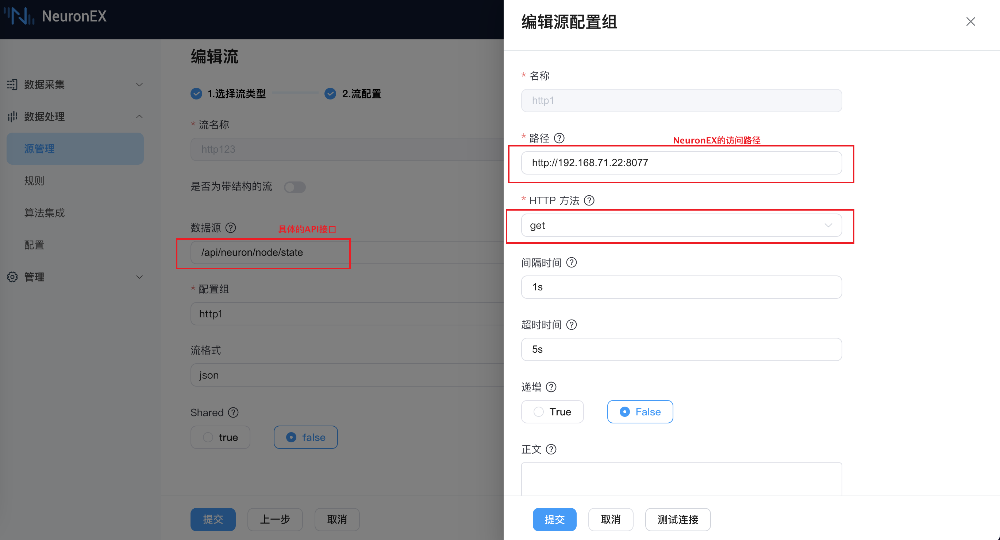
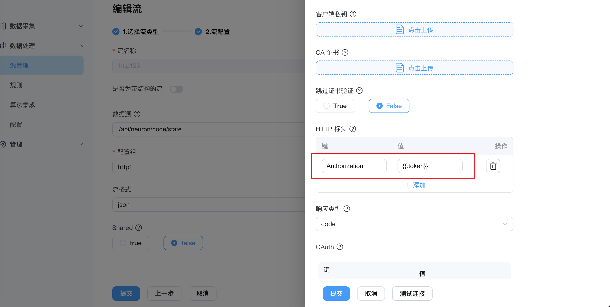
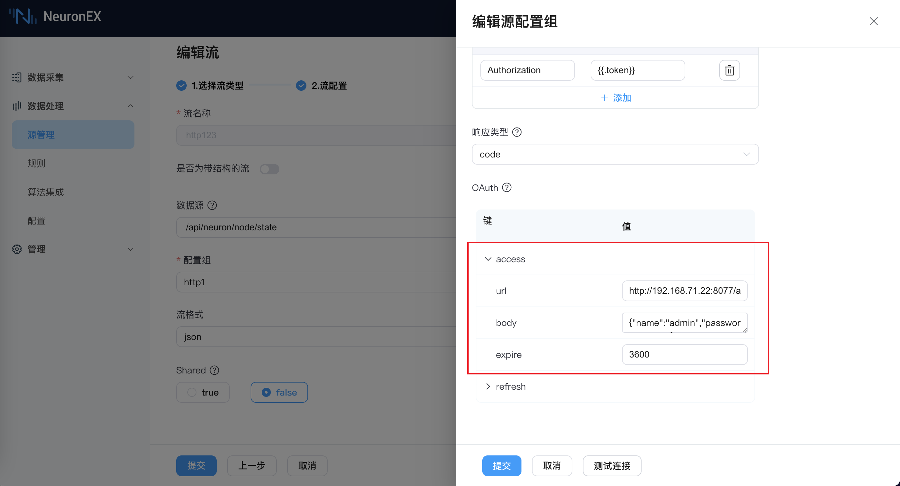
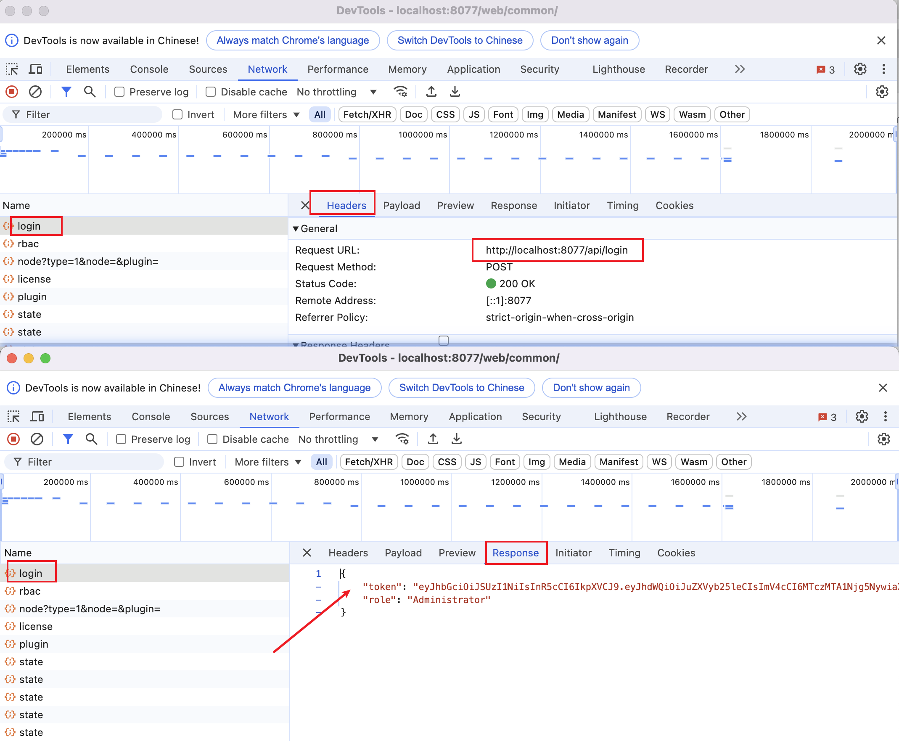
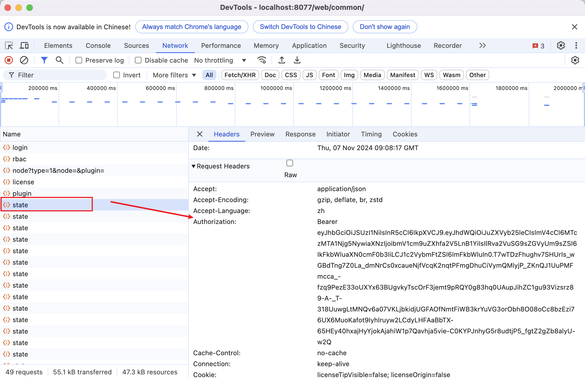

# HTTP Pull 源

<span style="background:green;color:white;">流</span>        <span style="background:green;color:white">扫描表</span>

NeuronEX 数据处理模块通过 `HTTP Pull` 类型的数据源，可以从 HTTP 服务器获取数据，该类型可以作为流、扫描表的数据源。

## 创建流

登录 NeuronEX，点击**数据处理** -> **源管理**。在**流管理**页签，点击**创建流**。

在弹出的**源管理** / **创建**页面，进入如下配置：

- **流名称**：输入流名称
- **是否为带结构的流**：勾选确认是否为带结构的流，如为带结构的流，则需进一步添加流字段。可默认不勾选。
- **流类型**：选择 httppull。
- **数据源（URL拼接路径）**：指定 URL 的路径部分，与配置组中的 `路径` 属性拼接成最终 URL。 例如配置组中的 `路径` 属性添填写为 `http://127.0.0.1:7000`，**数据源（URL拼接路径）** 填写为`/api/data`，则HTTP 完整请求地址为：`http://127.0.0.1:7000/api/data` 。
- **配置组**：可使用默认配置组，如希望自定义配置组，可点击添加配置组按钮，在弹出的对话框中进行如下设置，设置完成后，可点击**测试连接**进行测试：

  - **名称**：输入配置组名称。

  - **路径**： 指定请求服务器的地址。

  - **HTTP 方法**：HTTP 请求方法，可以是 post、get、put 或 delete。

  - **间隔时间**： 两次请求之间的时间间隔，单位为毫秒。

  - **超时时间**： HTTP 请求的超时时间，单位为毫秒。

  - **递增**： 如果设置为 True，将会与上一次的结果进行比较；如果连续两次请求的响应相同，则不会发送新的结果。默认值为 False。

  - **正文**：请求的正文，例如 `{"data": "data", "method": 1}`。

  - **正文类型**： 正文类型，可以是 none、text、json、html、xml、javascript 或 form。

  - **证书类型**：可选参数，填写证书路径，可以为绝对路径，也可以为相对路径。如果指定的是相对路径，那么父目录为执行 neuronex 命令的路径。示例值：`/var/xyz-certificate.pem`

  - **私钥路径**：可选参数，可以为绝对路径，也可以为相对路径。示例值：`/var/xyz-private.pem.key`

  - **根证书路径**：可选参数，用以验证服务器证书。可以为绝对路径，也可以为相对路径。示例值：`/var/xyz-rootca.pem`

  - **跳过证书验证**：控制是否跳过证书认证。如设置为 True，将跳过证书认证；否则进行证书验证。

  - **HTTP 标头**： 需要与 HTTP 请求一起发送的 HTTP 请求标头。

  - **响应类型**： 响应类型,可以是 `code` 或者 `body`，如果是 `code`，那么 NeuronEX 会检查 HTTP 响应码来判断响应状态。如果是 `body`，那么 NeuronEX 会检查 HTTP 响应正文，要求其为 JSON 格式，并且检查 code 字段的值。默认为 `code`。

  - **oAuth**： 配置 OAuth 验证流程。

    - access
      - url：获取访问码的网址，总是使用 POST 方法访问。
      - body：获取访问令牌的请求主体。通常情况下，可在这里提供授权码。
      - expire：令牌的过期时间，时间单位是秒，允许使用模板，所以必须是一个字符串。

    - refresh
      - url：刷新令牌的网址，总是使用 POST 方式请求。
      - headers：用于刷新令牌的请求头。通常把令牌放在这里，用于授权。
      - body：刷新令牌的请求主体。当使用头文件来传递刷新令牌时，可能不需要配置此选项。
- **流格式**：选择默认 json 格式。
- **共享**：勾选确认是否共享源。

示例配置如下：
```yaml

default:
  # 请求服务器地址的URL
  url: http://localhost:7000
  # post, get, put, delete
  method: post
  # 请求之间的间隔，时间单位为 ms
  interval: 10000
  # http请求超时，时间单位为 ms
  timeout: 5000
  # 如果将其设置为 true，则将与最后的结果进行比较； 如果两个请求的响应相同，则将跳过发送结果。
  # 可能的设置可能是：true/false
  incremental: false
  # 请求正文，例如'{"data": "data", "method": 1}'
  body: '{}'
  # 正文类型, none、text、json、html、xml、javascript、form
  bodyType: json
  # 请求所需的HTTP标头
  headers:
    Accept: application/json
  # 如何检查响应状态，支持通过状态码或 body
  responseType: code
  # 获取 token
#  oAuth:
#    # 设置如何获取访问码
#    access:
#      # 获取访问码的 URL，总是使用 POST 方法发送请求
#      url: https://127.0.0.1/api/token
#      # 请求正文
#      body: '{"username": "admin","password": "123456"}'
#      # 令牌的过期时间，以字符串表示，时间单位为秒，允许使用模板
#      expire: '3600'
#    # 如何刷新令牌
#    refresh:
#      # 刷新令牌的 URL，总是使用 POST 方法发送请求
#      url: https://127.0.0.1/api/refresh
#      # HTTP 请求头，允许使用模板
#      headers:
#        identityId: '{{.data.identityId}}'
#        token: '{{.data.token}}'
#      # 请求正文
#      body: ''


```

## 创建扫描表

HTTP Pull 源支持查询表。登录 NeuronEX，点击**数据处理** -> **源管理**。在**扫描表**页签，点击**创建扫描表**。

- **表名称**：输入表名称
- **是否为带结构的表**：勾选确认是否为带结构的表，如为带结构的表，则需进一步添加表字段
  - **名称**：字段名称
  - **类型**：支持 bigint、float、string、datetime、boolean、array、struct、bytea
- **表类型**：选择 httppull
- **数据源（URL拼接路径）**：指定 URL 的路径部分，与配置组中的 `路径` 属性拼接成最终 URL。 例如配置组中的 `路径` 属性添填写为 `http://127.0.0.1:7000`，**数据源（URL拼接路径）** 填写为`/api/data`，则HTTP 完整请求地址为：`http://127.0.0.1:7000/api/data` 。
- **配置组**：可使用默认配置组，如希望自定义配置组，可参考[创建流](#创建流)部分
- **表格式**：支持 json、binary、delimited、custom。

- **保留大小**：指定保留大小。

## 示例

本示例使用 HTTP Pull 源，读取 NeuronEX API 接口 `/api/neuron/node/state`，获取南向驱动状态信息，在这个过程中还会涉及到获取 NeuronEX Token 认证信息。

在该示例中，使用的 NeuronEX 版本为 3.4.1。

```shell
docker run -d --name neuronex -p 8077:8085 --log-opt max-size=100m emqx/neuronex:3.4.1
```

### 创建流

选择**流管理** -> **创建流**，在**创建流**页面选择 httppull 类型，进行如下配置：



在下图中 .token 为动态获取到的 NeuronEX Token 认证信息，获取方法见下下图。



下图中为获取到的 NeuronEX Token 配置方法。包括以下几个参数：

- access
  - url：http://192.168.71.22:8077/api/login  为 NeuronEX 登录地址
  - body：{"name":"admin","password":"0000"}  为 NeuronEX 登录时所需的账号密码
  - expire：令牌的过期时间，时间单位是3600秒



如何知晓 access 的返回结果，可以通过 F12 浏览器调试工具，在 Network 中找到 http://192.168.71.22:8077/api/login 的返回结果，在返回结果中可以看到 token 字段，这也是为什么在第二张图中的 Authorization 字段中填写 .token 的原因。 （也可以通过 Postman 工具进行测试）



为什么在图二中需要配置 Authorization 字段，因为 NeuronEX 默认运行会自动开启鉴权，所以需要手动配置。可以在 F12 浏览器调试工具中，在每个 NeuronEX 的 API 请求中的 Headers 中，都可以找到 Authorization 字段。



::: tip

在本示例中使用的 NeuronEX 端口为 8077，如果您使用的是8085默认端口，请在所有配置中将端口替换为8085。

:::

### 查看流结果

选择**规则** -> **新建规则**，在**新建规则**页面，选择**流**，选择上一步创建的流 `http123`，开启规则调试，即可看到从 NeuronEX API 接口 `/api/neuron/node/state` 获取到的南向驱动状态信息。表示 http pull 源获取数据成功。


